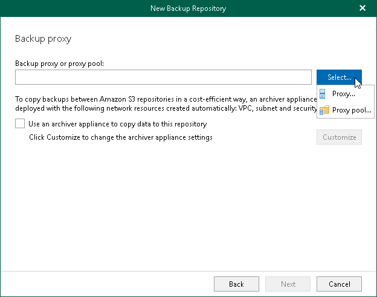
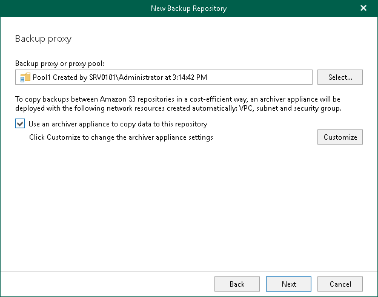
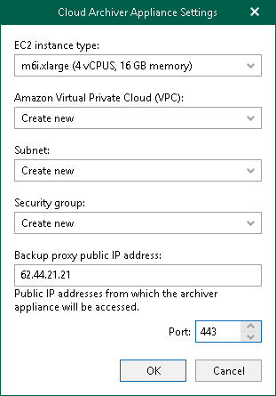

In this article

At this step of the wizard, configure the following settings:

* [Select a backup proxy server or a backup proxy pool](#pool).
* [Configure the Amazon Archiver appliance](#appliance).

Selecting Backup Proxy Server or Backup Proxy Pool

You can use the following components of the Veeam Backup for Microsoft 365 infrastructure:

* Default backup proxy server
* Remote backup proxy servers
* Backup proxy pools

Consider the following:

* A remote backup proxy server can be both Windows- and Linux-based.
* A remote backup proxy server must not be added to a backup proxy pool.
* A backup proxy pool may contain Windows- and Linux-based backup proxy servers.

To specify a backup proxy server or a backup proxy pool, do the following:

1. Click Select and select one of the following options:

* Proxy. Select this option to use the default backup proxy server or another remote backup proxy server.
* Proxy pool. Select this option to use a backup proxy pool.

1. In the Select Backup Proxy window, select a backup proxy server or a backup proxy pool that you want to use. You can select either one backup proxy server or one backup proxy pool.

|  |
| --- |
| Tip |
| Consider the following:   * To switch between components of different types, you can click the buttons in the upper-right corner. * To quickly find necessary backup proxy servers, you can use the search field at the bottom. |

* If you select a backup proxy server:

* If you select a backup proxy pool:

1. Click OK.

Configuring Amazon Archiver Appliance

You can optionally enable usage of the Amazon archiver appliance when Veeam Backup for Microsoft 365 creates a backup copy. Backed-up data is transferred between different instances of the general purpose object storage repositories (Amazon S3 Standard, Amazon S3 Standard-Infrequent Access and Amazon S3 One Zone-Infrequent Access storage classes) or to any of Amazon S3 Glacier object storage repositories (Amazon S3 Glacier Instant Retrieval, Amazon S3 Glacier Flexible Retrieval and Amazon S3 Glacier Deep Archive storage classes). For more information about supported Amazon S3 storage classes, see [Supported Amazon S3 Storage Classes](supported_storage_classes_amazon.md).

If you use the archiver appliance, it usually speeds up the backup copy process and helps you reduce costs incurred by your cloud storage provider. Also, using the archiver appliance, you protect your backups because all operations with backed-up data are performed within the Amazon cloud.

The Amazon archiver appliance is an auxiliary EC2 instance that is deployed and configured automatically by Veeam Backup for Microsoft 365 in Amazon EC2 only for the duration of a backup copy job. Veeam Backup for Microsoft 365 removes or reuses it after a backup copy job completes. By default, Veeam Backup for Microsoft 365 always keeps one archiver appliance for reuse.

|  |
| --- |
| Note |
| Even if you have enabled usage of the archiver appliance for the object storage repository, Veeam Backup for Microsoft 365 will not create it when transferring backed-up data between object storage repositories of different vendors. |

To enable usage of the Amazon archiver appliance, do the following:

1. Select the Use an archiver appliance to copy data to this repository check box.
2. Click Customize if you want to change the default settings of the archiver appliance.

1. In the Cloud Archiver Appliance Settings window, do the following:

1. From the EC2 instance type drop-down list, select the instance type for the archiver appliance. For more information on instance types, see [this Amazon article](https://aws.amazon.com/ec2/instance-types/).
2. From the Amazon Virtual Private Cloud (VPC) drop-down list, select the Amazon VPC where Veeam Backup for Microsoft 365 will launch the target instance. For more information on the Amazon VPC, see [this Amazon article](https://docs.aws.amazon.com/vpc/latest/userguide/what-is-amazon-vpc.html).
3. From the Subnet drop-down list, select the subnet for the archiver appliance.

Keep in mind that auto-assignment of public IPv4 addresses must be enabled in the subnet. For more information, see [this Amazon article](https://docs.aws.amazon.com/vpc/latest/userguide/vpc-ip-addressing.html#subnet-public-ip).

1. From the Security group drop-down list, select a security group that will be associated with the archiver appliance.

Keep in mind that the security group must allow inbound and outbound traffic through the listed [ports](vbo_used_ports.md#bp_ports). If a backup proxy pool is associated with the object storage repository, you must specify the public IP addresses of all backup proxy servers added to this backup proxy pool in the security group settings. For more information on security groups for Amazon VPC, see [this Amazon article](https://docs.aws.amazon.com/vpc/latest/userguide/VPC_SecurityGroups.html).

1. Specify the public IP address of the backup proxy server.

If a backup proxy pool is associated with the object storage repository, you can clear this field. In this case, you must specify the public IP addresses of all backup proxy servers added to this backup proxy pool in the security group settings.

1. Specify the port that Veeam Backup for Microsoft 365 will use to route requests between the archiver appliance and backup infrastructure components.
2. Click OK.

Page updated 3/26/2025

Page content applies to build 8.3.0.2201
