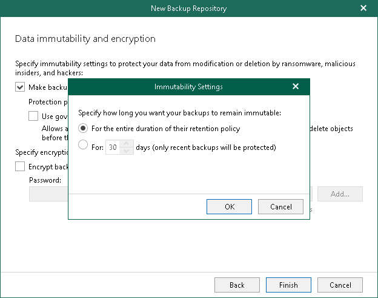
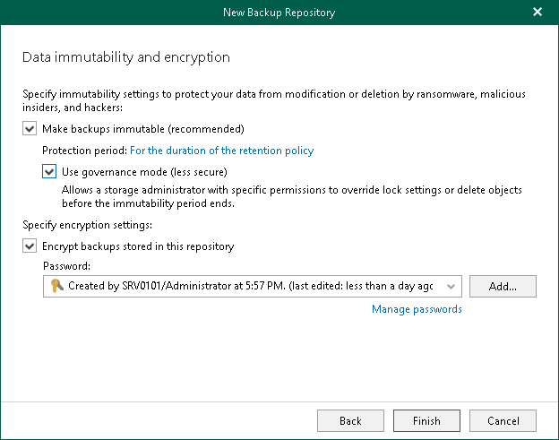

In this article

At this step of the wizard, you can enable protection of your backups against accidental data deletions and malware activity, and enable encryption of backups in object storage. For more information, see [Immutability](immutability.md) and [Data Encryption](data_encryption.md).

|  |
| --- |
| Note |
| If you do not want to use immutability, make sure that Versioning is not enabled for the Amazon S3 bucket in which you want to save your data. |

Enabling Data Immutability

To enable data immutability, do the following:

1. Select the Make backups immutable check box.

|  |
| --- |
| Note |
| This option is unavailable if you have selected the Keep forever option at the [previous](new_amazon_s3_retention.md) step of the wizard. |

1. Click the Protection period link to configure duration the immutability period. The For the duration of the retention policy value is specified by default.
2. In the Immutability Settings window, select one of the following options:

* For the entire duration of their retention policy. Select this option if you want to block your data for deletion or modification for the same period as the retention period. We recommend to use this option to store backup copies.

* For N days. Select this option if you want to block your data for deletion or modification for the specified period. By default, Veeam Backup for Microsoft 365 blocks data for 30 days.

|  |
| --- |
| Note |
| This option is unavailable in the following scenarios:   * If you have selected the Item-level retention option at the [previous](new_amazon_s3_retention.md) step of the wizard. * If you create one of the Amazon S3 Glacier storage classes: Amazon S3 Glacier Instant Retrieval, Amazon S3 Glacier Flexible Retrieval, or Amazon S3 Glacier Deep Archive. |

1. Select the Use governance mode check box if you want a storage administrator with specific permissions to be allowed to override the lock settings and to delete the protected backups in the object storage repository.

This check box is available only if the Make backups immutable check box is selected.

Enabling Encryption

To enable encryption, do the following:

1. Select the Encrypt backups stored in this repository check box to encrypt backups in object storage.
2. From the Password drop-down list, select an encryption password.

If you already have a password record that was configured beforehand, select such a record from the drop-down list. Otherwise, click Add and add an encryption password. For more information, see [Managing Encryption Passwords](managing_passwords.md). You can also click Manage passwords to [manage existing password records](edit_remove_password.md).

A password can be changed at any time. A password change does not impose any restrictions on accessing existing backup data in object storage.

|  |
| --- |
| Important |
| Make sure to remember your encryption password because, if lost, it cannot be restored. Editing of already created encryption passwords is not supported. |

Page updated 10/16/2024

Page content applies to build 8.3.0.2201
