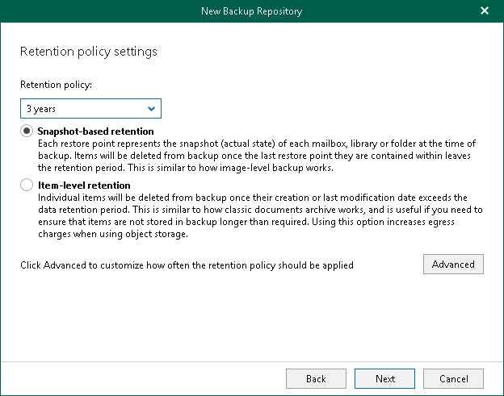

In this article

At this step of the wizard, specify [retention policy](retention_policy.md) settings.

To specify retention settings, do the following:

1. From the Retention policy drop-down list, choose how long your data should be stored in the object storage repository. For the Specified number of days option, specify number of days. Keep in mind that once configured, this setting cannot be changed.

|  |
| --- |
| Note |
| If you plan to enable data immutability at the [next](new_amazon_s3_configure_immutability.md) step of the wizard, we do not recommend to select the 10 years, 25 years and Keep forever options as Veeam Backup for Microsoft 365 will block your data for deletion and modification for a long period. For object storage repositories with the enabled data immutability, the Keep forever option is unavailable. |

1. Select a retention type:

* Snapshot-based retention.

Select this type if you want to keep an item until the restore point of an item's version is within the retention coverage.

* Item-level retention.

Select this type if you want to keep an item until its creation time or last modification time is within the retention coverage.

|  |
| --- |
| Note |
| The retention type of the object storage repository cannot be changed once set. |

1. Click Advanced if you want to specify when to apply a retention policy. You can select the following options:

* Daily at

Select this option if you want a retention policy to be applied on a daily basis and choose the time and day.

* Monthly at

Select this option if you want a retention policy to be applied on a monthly basis and choose the time and day which can be the first, second, third, fourth or even the last one in the month.

Page updated 8/29/2024

Page content applies to build 8.3.0.2201
