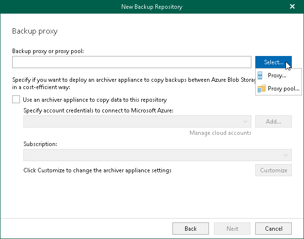
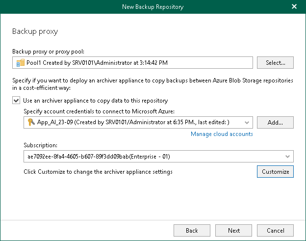
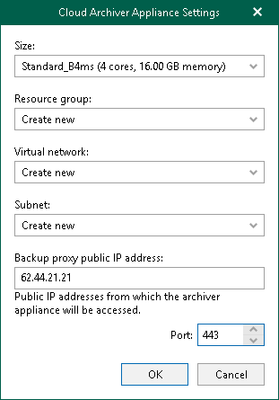

In this article

At this step of the wizard, configure the following settings:

* [Select a backup proxy server or a backup proxy pool](#pool).
* [Configure the Azure Archiver appliance](#appliance).

Selecting Backup Proxy Server or Backup Proxy Pool

You can use the following components of the Veeam Backup for Microsoft 365 infrastructure:

* Default backup proxy server
* Remote backup proxy servers
* Backup proxy pools

Consider the following:

* A remote backup proxy server can be both Windows- and Linux-based.
* A remote backup proxy server must not be added to a backup proxy pool.
* A backup proxy pool may contain Windows- and Linux-based backup proxy servers.

To specify a backup proxy server or a backup proxy pool, do the following:

1. Click Select and select one of the following options:

* Proxy. Select this option to use the default backup proxy server or another remote backup proxy server.
* Proxy pool. Select this option to use a backup proxy pool.

1. In the Select Backup Proxy window, select a backup proxy server or a backup proxy pool that you want to use. You can select either one backup proxy server or one backup proxy pool.

|  |
| --- |
| Tip |
| Consider the following:   * To switch between components of different types, you can click the buttons in the upper-right corner. * To quickly find necessary backup proxy servers, you can use the search field at the bottom. |

* If you select a backup proxy server:

* If you select a backup proxy pool:

1. Click OK.

Configuring Azure Archiver Appliance

You can optionally enable usage of the Azure archiver appliance when Veeam Backup for Microsoft 365 transfers backed-up data between different instances of Azure Blob Storage or to Azure Blob Storage Archive. If you use the Azure archiver appliance, it usually speeds up the backup copy process and helps you reduce costs incurred by your cloud storage provider.

The Azure archiver appliance is a small auxiliary machine in Microsoft Entra that is deployed and configured automatically by Veeam Backup for Microsoft 365. Veeam services that Veeam Backup for Microsoft 365 installs on the Azure archiver appliance compress data passed through. This helps reduce network traffic and increase the speed of backup copy.

The process of the Azure archiver appliance deployment takes a couple of minutes. If you enable usage of the Azure archiver appliance, Veeam Backup for Microsoft 365 will create the archiver appliance at the beginning of a backup copy job and remove or reuse it after a backup copy job completes. By default, Veeam Backup for Microsoft 365 always keeps one archiver appliance for reuse.

If you do not want to use the Azure archiver appliance, skip this step.

|  |
| --- |
| Note |
| Even if you have enabled usage of the archiver appliance for the object storage repository, Veeam Backup for Microsoft 365 will not create it when transferring backed-up data between object storage repositories of different vendors. |

To enable usage of the Azure archiver appliance, do the following:

1. Select the Use an archiver appliance to copy data to this repository check box.
2. From the Specify account credentials to connect to Microsoft Azure drop-down list, select a service account credentials to access Microsoft Entra.

If you already have a credentials record that was configured beforehand, select such a record from the drop-down list. Otherwise, click Add and configure a new Azure service account using the Add Azure Service Account wizard. For more information, see [Adding Microsoft Azure Service Account](azure_service_account.md). You can also click Manage cloud accounts to [manage existing credentials records](edit_remove_cloud_creds.md).

1. From the Subscription drop-down list, select Microsoft Azure subscription.
2. Click Customize if you want to change the default settings of the archiver appliance.

1. In the Cloud Archiver Appliance Settings window, do the following:

1. From the Size drop-down list, select the size of the appliance.
2. From the Resource group drop-down list, select a resource group that will be associated with the archiver appliance.

Keep in mind that the resource group must allow inbound and outbound traffic through the listed [ports](vbo_used_ports.md#bp_ports). If a backup proxy pool is associated with the object storage repository, you must specify the public IP addresses of all backup proxy servers added to this backup proxy pool in the resource group settings.

1. From the Virtual network drop-down list, select a network to which the archiver appliance must be connected.
2. From the Subnet drop-down list, select the subnet for the archiver appliance.
3. Specify the public IP address of the backup proxy server.

If a backup proxy pool is associated with the object storage repository, you can clear this field. In this case, you must specify the public IP addresses of all backup proxy servers added to this backup proxy pool in the resource group settings.

1. Specify the port that Veeam Backup for Microsoft 365 will use to route requests between the archiver appliance and backup infrastructure components.
2. Click OK.

Related Topics

[Permissions for Azure Archiver Appliance](azure_archiver_appliance_permissions.md)

Page updated 3/26/2025

Page content applies to build 8.3.0.2201
