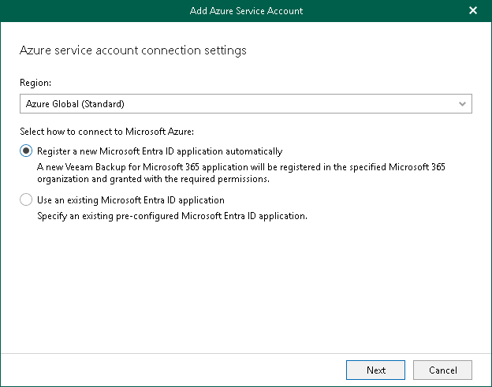

In this article

At this step of the wizard, select a Microsoft Entra region and choose whether you want to register a new [Microsoft Entra application](https://docs.microsoft.com/en-us/azure/active-directory/manage-apps/what-is-application-management) to connect to Microsoft Entra or use an existing Microsoft Entra application.

To select a region and connection method, do the following:

1. From the Region drop-down list, select a Microsoft Entra region.
2. Select one of the following options:

* Register a new Microsoft Entra ID application automatically

With this option selected, Veeam Backup for Microsoft 365 requires to provide an application name and certificate to register a new Microsoft Entra application in Microsoft Entra ID. For more information, see [Registering New Microsoft Entra Application](new_azure_service_account_2.md#cna).

* Use an existing Microsoft Entra ID application

With this option selected, Veeam Backup for Microsoft 365 requires to provide connection parameters to the existing Microsoft Entra application. For more information, see [Using Existing Microsoft Entra Application](new_azure_service_account_2.md#uea).

Page updated 1/31/2025

Page content applies to build 8.3.0.2201
