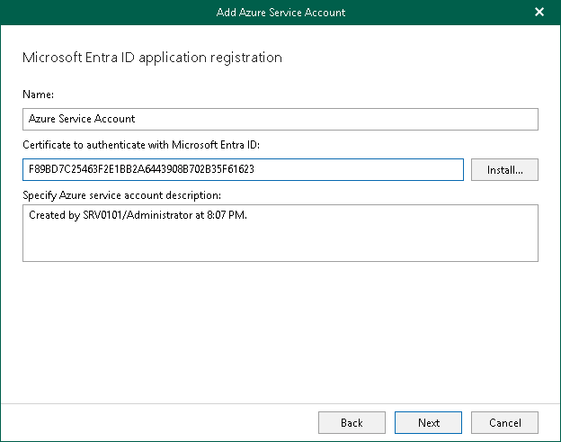
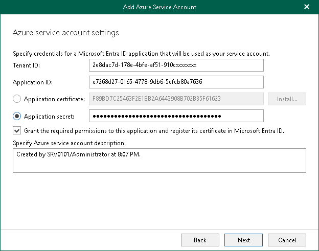

# Step 3. Register or Select Microsoft Entra Application

At this step of the wizard, you can create a new application in Microsoft Entra ID or select an existing one.

* [Registering a new application](#cna)

Use this method if you have selected the Register a new Microsoft Entra ID application automatically option at the previous step of the wizard.

* [Using an existing application](#uea)

Use this method if you have selected the Use an existing Microsoft Entra ID application option at the previous step of the wizard.

Registering New Microsoft Entra Application

You can register a new Microsoft Entra application in Microsoft Entra ID. Veeam Backup for Microsoft 365 will use this application for data exchange when transferring backed-up data between different instances of Azure Blob Storage or to Azure Blob Storage Archive during backup copy jobs.

When registering a new Microsoft Entra application, Veeam Backup for Microsoft 365 automatically grants the [required permissions](azure_archiver_appliance_permissions.md) to this application.

To register a new Microsoft Entra application, do the following:

1. In the Name field, enter a name that you want to use to register a new Microsoft Entra application in your Microsoft Entra ID.
2. Click Install to specify an SSL certificate that you want to use for data exchange between Veeam Backup for Microsoft 365 and a Microsoft Entra application.

You can generate a new self-signed certificate or use an existing one. When generating a new self-signed certificate, Veeam Backup for Microsoft 365 will register it in Microsoft Entra ID automatically. Before using an existing certificate, make sure to register this certificate in Microsoft Entra ID. For more information, see [this Microsoft article](https://docs.microsoft.com/en-us/azure/active-directory/develop/howto-create-service-principal-portal#certificates-and-secrets).

1. In the Select Certificate wizard, proceed to any of the following options:

* [Generate a new self-signed certificate](vbo_installing_certificate.md#generate_new)

* [Select certificate from the Certificate Store of this server](vbo_installing_certificate.md#selecting_file)
* [Import certificate from a PFX file](vbo_installing_certificate.md#import)

1. In the Specify Azure service account description field, enter optional description.

Using Existing Microsoft Entra Application

You can specify an existing Microsoft Entra application in your Microsoft Entra ID. Veeam Backup for Microsoft 365 will use this application for data exchange when transferring backed-up data between different instances of Azure Blob Storage or to Azure Blob Storage Archive during backup copy jobs.

To use an existing application, do the following:

1. In the Tenant ID field, specify the tenant ID in Microsoft Entra ID.
2. In the Application ID field, specify an identification number of your Microsoft Entra application.

You can find this number in an application settings in your Microsoft Entra ID. For more information, see [this Microsoft article](https://docs.microsoft.com/en-us/azure/active-directory/develop/howto-create-service-principal-portal).

1. Select an authentication type. You can select either Application secret or Application certificate:

1. To use a certificate, select the Application certificate option and click Install.

You can generate a new self-signed certificate or use an existing one. When generating a new self-signed certificate, Veeam Backup for Microsoft 365 will register it in Microsoft Entra ID automatically. Before using an existing certificate, make sure to register this certificate in Microsoft Entra ID. For more information, see [this Microsoft article](https://docs.microsoft.com/en-us/azure/active-directory/develop/howto-create-service-principal-portal#certificates-and-secrets).

In the Select Certificate wizard, proceed to any of the following options:

* [Generate a new self-signed certificate](vbo_installing_certificate.md#generate_new)
* [Select certificate from the Certificate Store of this server](vbo_installing_certificate.md#selecting_file)
* [Import certificate from a PFX file](vbo_installing_certificate.md#import)

1. To use a secret key, select the Application secret option and enter a secret key in the field nearby to access your custom application.

To obtain a secret key, you will need to generate it first. For more information on how to generate a secret key, see [this Microsoft article](https://docs.microsoft.com/en-us/azure/active-directory/develop/howto-create-service-principal-portal#certificates-and-secrets).

Keep in mind that a key will become hidden once you leave or refresh the page in Microsoft Identity platform. Consider saving the key to a secure location.

1. Select the Grant the required permissions to this application and register its certificate in Microsoft Entra ID check box to automatically grant the [required permissions](azure_archiver_appliance_permissions.md) to Microsoft Entra application.

Veeam Backup for Microsoft 365 will also register the specified certificate in your Microsoft Entra ID.

Keep in mind that you do not need to select this check box if you have granted the required permissions to the specified Microsoft Entra application beforehand and already registered its certificate in Microsoft Entra ID. If the Grant the required permissions to this application and register its certificate in Microsoft Entra ID check box is not selected, Veeam Backup for Microsoft 365 skips the [Log in to Microsoft 365](new_azure_service_account_3.md) and [Select Microsoft Azure Subscription](new_azure_service_account_4.md) steps and finishes the wizard.

1. In the Specify Azure service account description field, enter optional description.

