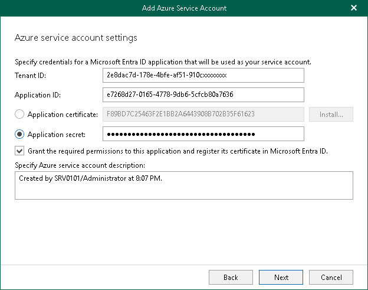

# Using Existing Microsoft Entra Application

You can specify an existing Microsoft Entra application in your Microsoft Entra ID. Veeam Backup for Microsoft 365 will use this application for data exchange when transferring backed-up data between different instances of Azure Blob Storage or to Azure Blob Storage Archive during backup copy jobs.

To use an existing application, do the following:

1. In the Tenant ID field, specify the tenant ID in Microsoft Entra ID.
2. In the Application ID field, specify an identification number of your Microsoft Entra application.

You can find this number in an application settings in your Microsoft Entra ID. For more information, see [this Microsoft article](https://docs.microsoft.com/en-us/azure/active-directory/develop/howto-create-service-principal-portal).

1. To use a certificate as an authentication type, select the Application certificate option and click Install.

You can generate a new self-signed certificate or use an existing one. When generating a new self-signed certificate, Veeam Backup for Microsoft 365 will register it in Microsoft Entra ID automatically. Before using an existing certificate, make sure to register this certificate in Microsoft Entra ID. For more information, see [this Microsoft article](https://docs.microsoft.com/en-us/azure/active-directory/develop/howto-create-service-principal-portal#certificates-and-secrets).

In the Select Certificate wizard, proceed to any of the following options:

Generate a new self-signed certificate

|  |
| --- |
| Perform the following steps:   1. Select the Generate a new self-signed certificate option.      1. Specify a certificate name and click Finish.    |

Import an existing TLS certificate from the certificate store

|  |  |  |
| --- | --- | --- |
| Perform the following steps:   1. Select the Select certificate from the Certificate Store of this server option.      1. Select the certificate from the certificate store and click Finish.   |  | | --- | | Note | | A TLS certificate that you want to use must be added to the Personal certificate store. It also must have a private exportable key. |   |

Import a TLS certificate from a file in the PFX format

|  |  |  |
| --- | --- | --- |
| Perform the following steps:   1. Select the Import certificate from a PFX file option.      1. Click Browse and select a PFX file. Specify the certificate password if required.   |  | | --- | | Note | | A TLS certificate that you want to use must have a private exportable key. |     1. Click Finish. |

1. To use a secret key as an authentication type instead of the certificate, select the Application secret option and enter a secret key in the field nearby to access your custom application.

To obtain a secret key, you will need to generate it first. For more information on how to generate a secret key, see [this Microsoft article](https://docs.microsoft.com/en-us/azure/active-directory/develop/howto-create-service-principal-portal#certificates-and-secrets).

Keep in mind that a key will become hidden once you leave or refresh the page in Microsoft Identity platform. Consider saving the key to a secure location.

1. Select the Grant the required permissions to this application and register its certificate in Microsoft Entra ID check box to automatically grant the [required permissions](azure_archiver_appliance_permissions.md) to Microsoft Entra application.

Veeam Backup for Microsoft 365 will also register the specified certificate in your Microsoft Entra ID.

Keep in mind that you do not need to select this check box if you have granted the required permissions to the specified Microsoft Entra application beforehand and already registered its certificate in Microsoft Entra ID. If the Grant the required permissions to this application and register its certificate in Microsoft Entra ID check box is not selected, Veeam Backup for Microsoft 365 skips the [Log in to Microsoft 365](new_azure_service_account_3.md) and [Select Microsoft Azure Subscription](new_azure_service_account_4.md) steps and finishes the wizard.

1. In the Specify Azure service account description field, enter optional description.

