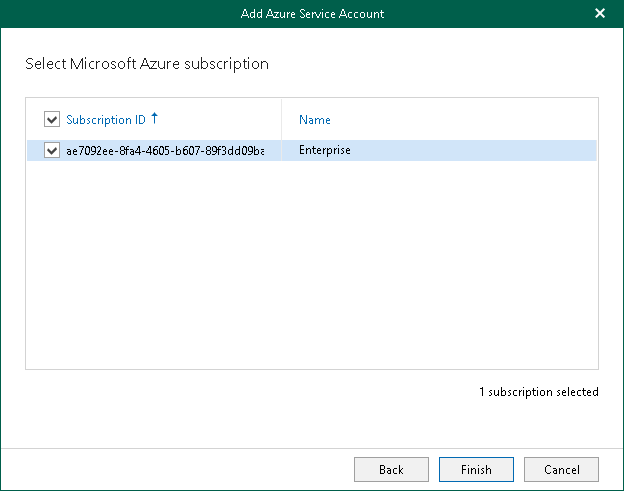

# Step 5. Select Microsoft Azure Subscription

At this step of the wizard, select check boxes next to Microsoft Azure subscriptions in the list. The subscription list contains all subscriptions associated with the user account that you have used to sign in to Microsoft Identity platform.

