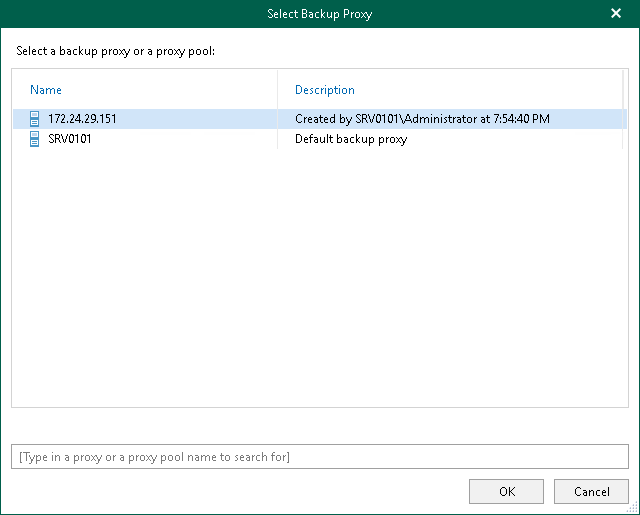
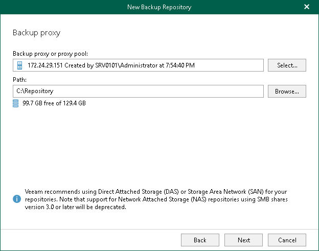

In this article

At this step of the wizard, select a backup proxy server and specify a directory where you want to store backups.

|  |
| --- |
| Note |
| Directory where you want to store backups must not be the Veeam Backup for Microsoft 365 installation folder. |

You can use the default backup proxy server or another remote backup proxy server added to the Veeam Backup for Microsoft 365 infrastructure.

Consider the following:

* By default, Veeam Backup for Microsoft 365 will use the default backup proxy server.
* A remote backup proxy server must be Windows-based.
* A remote backup proxy server must not be added to a backup proxy pool.

To specify a backup proxy server and a directory for storing backups, do the following:

1. Use the default backup proxy server, or if you want to use a remote backup proxy server, click Select, and then do the following:

1. In the Select Backup Proxy window, select a backup proxy server that you want to use. You can select only one backup proxy server.

|  |
| --- |
| Tip |
| To quickly find necessary backup proxy servers, you can use the search field at the bottom. |

1. Click OK.

1. In the Path field, specify a directory to store your backups. To do this, click Browse and select a directory.

|  |
| --- |
| Note |
| To use a shared folder, provide the path manually. For more information about shared folders, see [Network Attached Storage (SMB Shares)](br_smb.md). |

1. Click Get free space if you want to know the available space on the selected backup proxy server.

Page updated 3/26/2025

Page content applies to build 8.3.0.2201
