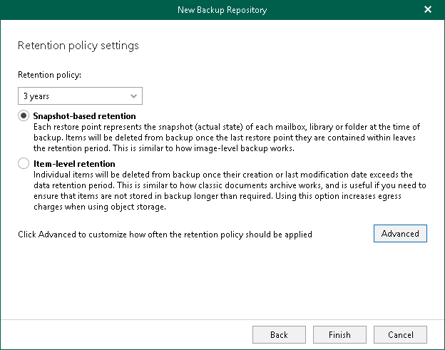

# Step 5. Specify Retention Policy Settings

At this step of the wizard, specify [retention policy](retention_policy.md) settings.

To specify retention settings, do the following:

1. From the Retention policy drop-down list, choose how long your data should be stored in the backup repository.
2. Select a retention type:

* Snapshot-based retention.

Select this type if you want to keep an item until the restore point of an item's version is within the retention coverage.

* Item-level retention.

Select this type if you want to keep an item until its creation time or last modification time is within the retention coverage.

|  |
| --- |
| Note |
| The retention type of a JET-based backup repository cannot be changed once set. |

1. Click Advanced if you want to specify when to apply a retention policy. You can select the following options:

* Daily at

Select this option if you want a retention policy to be applied on a daily basis and choose the time and day.

* Monthly at

Select this option if you want a retention policy to be applied on a monthly basis and choose the time and day which can be the first, second, third, fourth or even the last one in the month.

