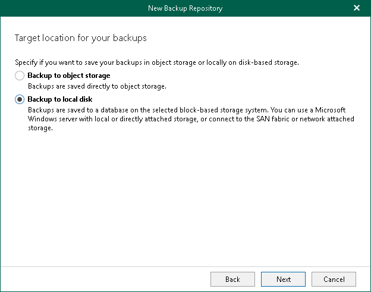

In this article

At this step of the wizard, select Backup to local disk to save your backups locally in a JET-based storage system.

Page updated 7/17/2024

Page content applies to build 8.3.0.2201
