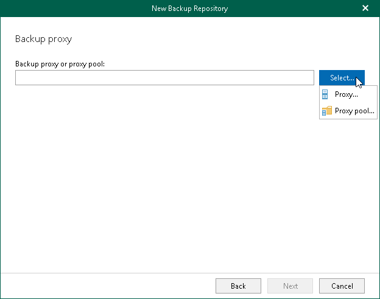
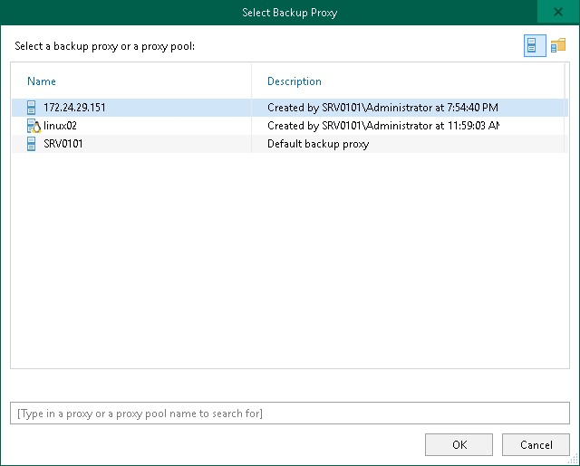
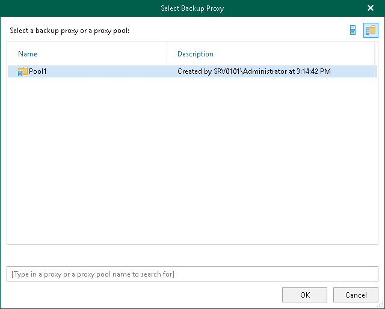

# Step 7. Specify Backup Proxy Server or Backup Proxy Pool

At this step of the wizard, select a backup proxy server or a backup proxy pool.

You can use the following components of the Veeam Backup for Microsoft 365 infrastructure:

* Default backup proxy server
* Remote backup proxy servers
* Backup proxy pools

Consider the following:

* A remote backup proxy server can be both Windows- and Linux-based.
* A remote backup proxy server must not be added to a backup proxy pool.
* A backup proxy pool may contain Windows- and Linux-based backup proxy servers.

To specify a backup proxy server or a backup proxy pool, do the following:

1. Click Select and select one of the following options:

* Proxy. Select this option to use the default backup proxy server or another remote backup proxy server.
* Proxy pool. Select this option to use a backup proxy pool.

1. In the Select Backup Proxy window, select a backup proxy server or a backup proxy pool that you want to use. You can select either one backup proxy server or one backup proxy pool.

|  |
| --- |
| Tip |
| Consider the following:   * To switch between components of different types, you can click the buttons in the upper-right corner. * To quickly find necessary backup proxy servers, you can use the search field at the bottom. |

* If you select a backup proxy server:

* If you select a backup proxy pool:

1. Click OK.

