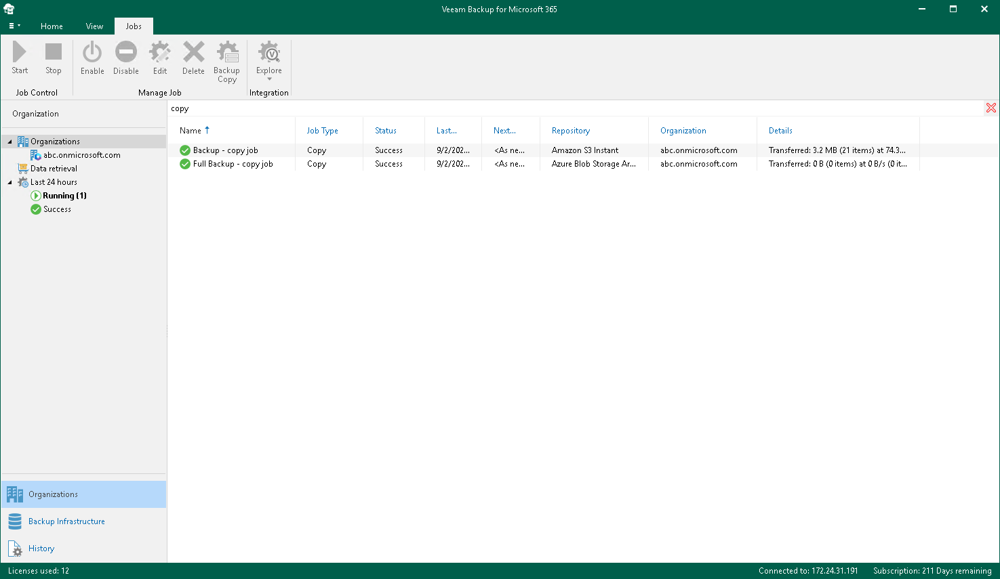
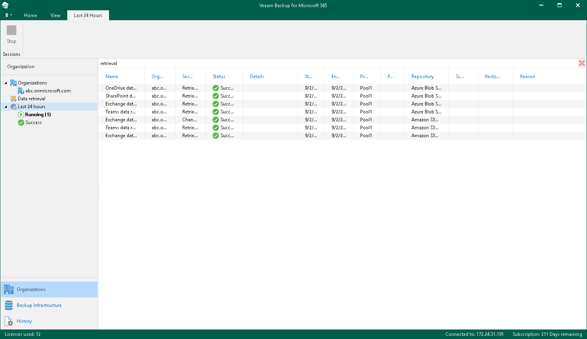

# Performing Search

In the Organizations view of the Veeam Backup for Microsoft 365 console, you can search for the following entities using keywords:

* Backup and backup copy jobs configured for Microsoft organizations.
* Backup, backup copy, retrieve, restore and data management sessions performed by Veeam Backup for Microsoft 365 within the last 24 hours.

Searching for Jobs

To search for backup and backup copy jobs, do the following:

1. Open the Organizations view.
2. In the inventory pane, do one of the following:

* If you want to search for backup and backup copy jobs configured for all organizations added to Veeam Backup for Microsoft 365, select the root Organizations node.
* If you want to search for backup and backup copy jobs configured for a specific organization, select an organization node.

1. Enter a search query in the search field at the top of the preview pane.

Veeam Backup for Microsoft 365 will display only backup and backup copy jobs whose names include keywords that you are searching for.

To remove a keyword, click the cross mark.

Searching for Sessions

To search for backup, backup copy, retrieve, restore and data management sessions performed by Veeam Backup for Microsoft 365 within the last 24 hours, do the following:

1. Open the Organizations view.
2. In the inventory pane, select either the Last 24 hours node or one of its subnodes to search for sessions with a particular status.
3. Enter a search query in the search field at the top of the preview pane.

Veeam Backup for Microsoft 365 will display only sessions whose names include keywords that you are searching for.

To remove a keyword, click the cross mark.

