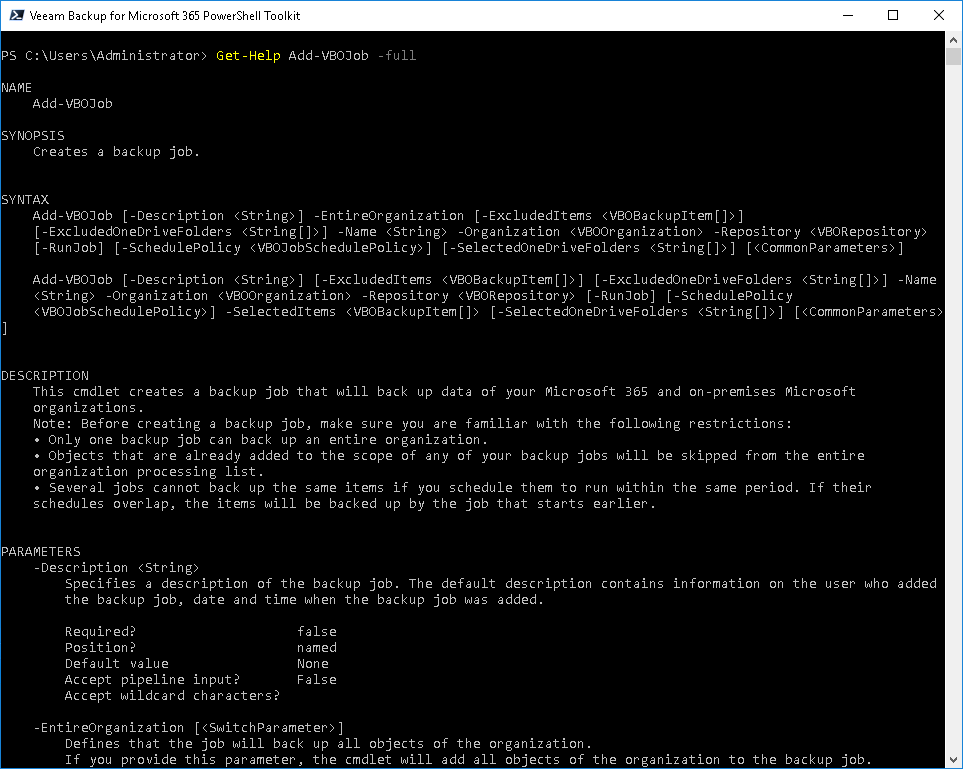

In this article

The Get-Help cmdlet is a Microsoft cmdlet that works for Veeam.Archiver.PowerShell, Veeam.Exchange.Powershell, Veeam.SharePoint.Powershell and Veeam.Teams.PowerShell modules as well.

To get full details about the necessary cmdlet, run the Get-Help <cmdletname> -full command from your PowerShell console. The Get-Help command will return a whole set of parameters that are available for the cmdlet and an input type for each parameter.

|  |
| --- |
|  Note |
| The online help for PowerShell on [Veeam Help Center](https://www.veeam.com/documentation-guides-datasheets.html) always provides more accurate information than the help reference that is integrated into the product. The online help is updated regularly and contains all fixes based on customers feedback. |

Page updated 8/5/2024

Page content applies to build 8.3.0.2201
