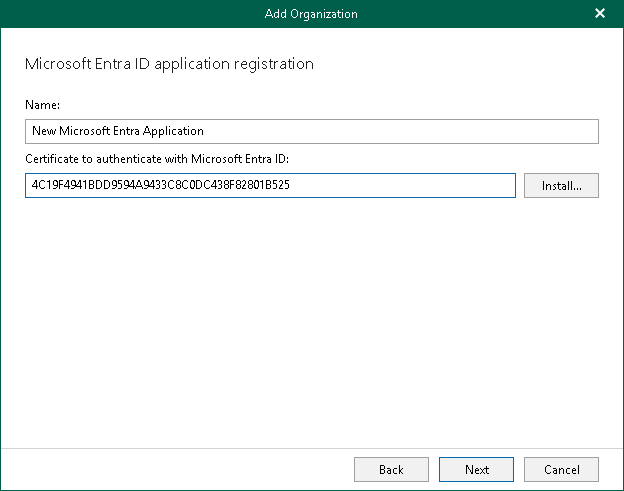
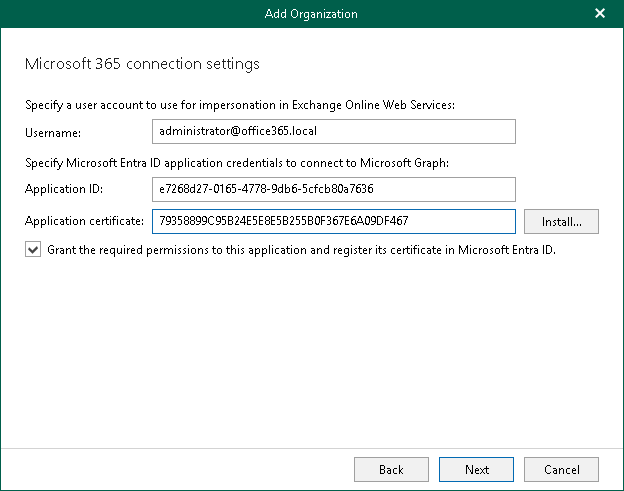

In this article

At this step of the wizard, you can create a new application in Microsoft Entra ID or select an existing one.

* [Registering a new application](#cna)

Use this method if you have selected the Register a new Microsoft Entra ID application automatically option at the previous step of the wizard.

* [Using an existing application](#uea)

Use this method if you have selected the Use an existing Microsoft Entra ID application option at the previous step of the wizard.

Registering New Microsoft Entra Application

|  |
| --- |
| Note |
| If you want to back up team chats and you have selected the Teams chats check box at the [Select Organization Deployment Type](vbo_add_o365_sd.md) step of the wizard, registering a new Microsoft Entra application is unavailable. |

You can register a new Microsoft Entra application in Microsoft Entra ID. Veeam Backup for Microsoft 365 will use this application for data exchange with your Microsoft 365 organizations during backup and restore sessions.

When registering a new Microsoft Entra application, Veeam Backup for Microsoft 365 automatically grants the [required permissions](ad_app_permissions_sd.md) to this application.

To register a new Microsoft Entra application, do the following:

1. In the Name field, enter a name that you want to use to register a new Microsoft Entra application in your Microsoft Entra ID.
2. Click Install to specify an SSL certificate that you want to use for data exchange between Veeam Backup for Microsoft 365 and a Microsoft Entra application.

You can generate a new self-signed certificate or use an existing one. When generating a new self-signed certificate, Veeam Backup for Microsoft 365 will register it in Microsoft Entra ID automatically. Before using an existing certificate, make sure to register this certificate in Microsoft Entra ID. For more information, see [this Microsoft article](https://docs.microsoft.com/en-us/azure/active-directory/develop/howto-create-service-principal-portal#certificates-and-secrets).

1. In the Select Certificate wizard, proceed to any of the following options:

* [Generate a new self-signed certificate](vbo_installing_certificate.md#generate_new)

* [Select certificate from the Certificate Store of this server](vbo_installing_certificate.md#selecting_file)
* [Import certificate from a PFX file](vbo_installing_certificate.md#import)

Using Existing Microsoft Entra Application

You can specify an existing Microsoft Entra application in your Microsoft Entra ID. Veeam Backup for Microsoft 365 will use this application for data exchange with your Microsoft 365 organizations during backup and restore sessions.

To use an existing application, do the following:

1. In the Username field, enter a user account that you want to use for impersonation. For more information about impersonation, see [this Microsoft article](https://docs.microsoft.com/en-us/exchange/client-developer/exchange-web-services/impersonation-and-ews-in-exchange).

You can enter any account that belongs to your Microsoft 365 organization using the following format: name@<domain\_name>.<domain>. For example, user@abc.com.

|  |
| --- |
| Note |
| If you plan to back up public folder mailboxes, this user account must be granted the Owner role and have a valid Exchange Online license and an active mailbox within the Microsoft 365 organization. |

Keep in mind that if you select only SharePoint Online and OneDrive for Business services to protect at the [Select Organization Deployment Type](vbo_add_o365_sd.md) step, Veeam Backup for Microsoft 365 displays the Specify organization name field instead. In this field, specify a domain name of your Microsoft 365 organization without the user name. For example, abc.com.

1. In the Application ID field, specify an identification number of Microsoft Entra application that you want to use to access your Microsoft 365 organization.

You can find this number in the application settings of your Microsoft Entra ID. For more information, see [this Microsoft article](https://docs.microsoft.com/en-us/azure/active-directory/develop/howto-create-service-principal-portal).

1. Click Install to specify an SSL certificate that you want to use for data exchange between Veeam Backup for Microsoft 365 and the specified Microsoft Entra application.

You can generate a new self-signed certificate or use an existing one. When generating a new self-signed certificate, Veeam Backup for Microsoft 365 will register it in Microsoft Entra ID automatically. Before using an existing certificate, make sure to register this certificate in Microsoft Entra ID. For more information, see [this Microsoft article](https://docs.microsoft.com/en-us/azure/active-directory/develop/howto-create-service-principal-portal#certificates-and-secrets).

1. In the Select Certificate wizard, proceed to any of the following options:

* [Generate a new self-signed certificate](vbo_installing_certificate.md#generate_new)

* [Select certificate from the Certificate Store of this server](vbo_installing_certificate.md#selecting_file)
* [Import certificate from a PFX file](vbo_installing_certificate.md#import)

1. Select the Grant the required permissions to this application and register its certificate in Microsoft Entra ID check box to automatically grant the [required permissions](ad_app_permissions_sd.md) to Microsoft Entra application.

Veeam Backup for Microsoft 365 will also register the specified certificate in your Microsoft Entra ID.

Keep in mind that you do not need to select this check box if you have granted the required permissions to the specified Microsoft Entra application beforehand and already registered its certificate in Microsoft Entra ID. If the Grant the required permissions to this application and register its certificate in Microsoft Entra ID check box is not selected, Veeam Backup for Microsoft 365 skips the [Log in to Microsoft 365](login_to_microsoft.md) step and proceeds to [Finish Working With Wizard](finish_wizard_sd.md).

Page updated 5/21/2025

Page content applies to build 8.3.0.2201
