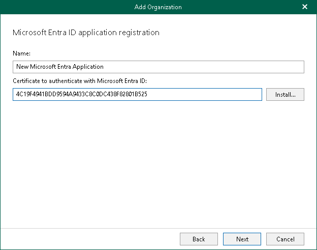

# Registering New Microsoft Entra Application

|  |
| --- |
| Note |
| If you want to back up team chats and you have selected the Teams chats check box at the [Select Organization Deployment Type](vbo_add_o365_sd.md) step of the wizard, registering a new Microsoft Entra application is unavailable. |

You can register a new Microsoft Entra application in Microsoft Entra ID. Veeam Backup for Microsoft 365 will use this application for data exchange with your Microsoft 365 organizations during backup and restore sessions.

When registering a new Microsoft Entra application, Veeam Backup for Microsoft 365 automatically grants the [required permissions](ad_app_permissions_sd.md) to this application.

To register a new Microsoft Entra application, do the following:

1. In the Name field, enter a name that you want to use to register a new Microsoft Entra application in your Microsoft Entra ID.
2. Click Install to specify a TLS certificate that you want to use for data exchange between Veeam Backup for Microsoft 365 and a Microsoft Entra application.

You can generate a new self-signed certificate or use an existing one. When generating a new self-signed certificate, Veeam Backup for Microsoft 365 will register it in Microsoft Entra ID automatically. Before using an existing certificate, make sure to register this certificate in Microsoft Entra ID. For more information, see [this Microsoft article](https://docs.microsoft.com/en-us/azure/active-directory/develop/howto-create-service-principal-portal#certificates-and-secrets).

1. In the Select Certificate wizard, proceed to any of the following options:

Generate a new self-signed certificate

|  |
| --- |
| Perform the following steps:   1. Select the Generate a new self-signed certificate option.      1. Specify a certificate name and click Finish.    |

Import an existing TLS certificate from the certificate store

|  |  |  |
| --- | --- | --- |
| Perform the following steps:   1. Select the Select certificate from the Certificate Store of this server option.      1. Select the certificate from the certificate store and click Finish.   |  | | --- | | Note | | A TLS certificate that you want to use must be added to the Personal certificate store. It also must have a private exportable key. |   |

Import a TLS certificate from a file in the PFX format

|  |  |  |
| --- | --- | --- |
| Perform the following steps:   1. Select the Import certificate from a PFX file option.      1. Click Browse and select a PFX file. Specify the certificate password if required.   |  | | --- | | Note | | A TLS certificate that you want to use must have a private exportable key. |     1. Click Finish. |

