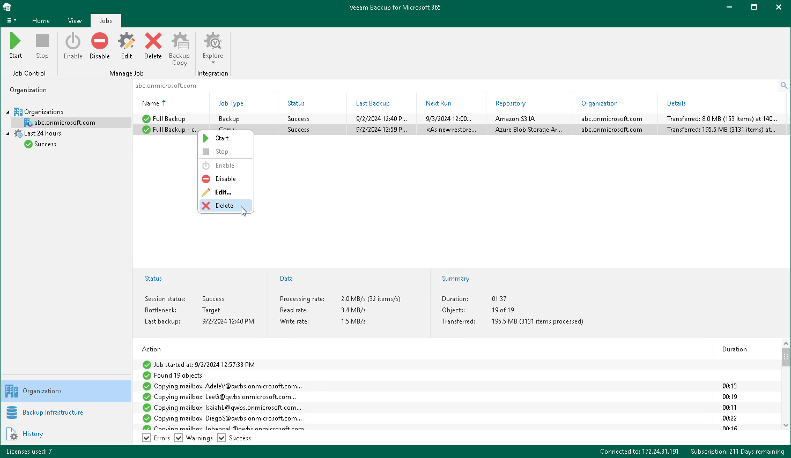

In this article

You can remove a backup copy job from the Veeam Backup for Microsoft 365 configuration.

|  |
| --- |
| Note |
| When you remove a backup copy job, Veeam Backup for Microsoft 365 keeps backup copies in the target object storage repository. You can retrieve your backed-up data from the target object storage repository or explore backup copies. For more information, see [Retrieving Backed-Up Data](retrieving_backed_up_files.md) and [Exploring Backup Copies](vbo_exploring_backup_copies.md). |

To remove a backup copy job from the Veeam Backup for Microsoft 365 configuration, do the following:

1. Open the Organizations view.
2. In the inventory pane, select an organization.

|  |
| --- |
| Tip |
| You can also select the root Organizations node to see all backup and backup copy jobs that were created for all organizations added to the scope. |

1. In the preview pane, do one of the following:

* Select a backup copy job and click Delete on the ribbon.
* Right-click a backup copy job and select Delete.

A backup copy job name consists of a backup job name for which a backup copy job is created and the copy job postfix.

Page updated 9/2/2024

Page content applies to build 8.3.0.2201
