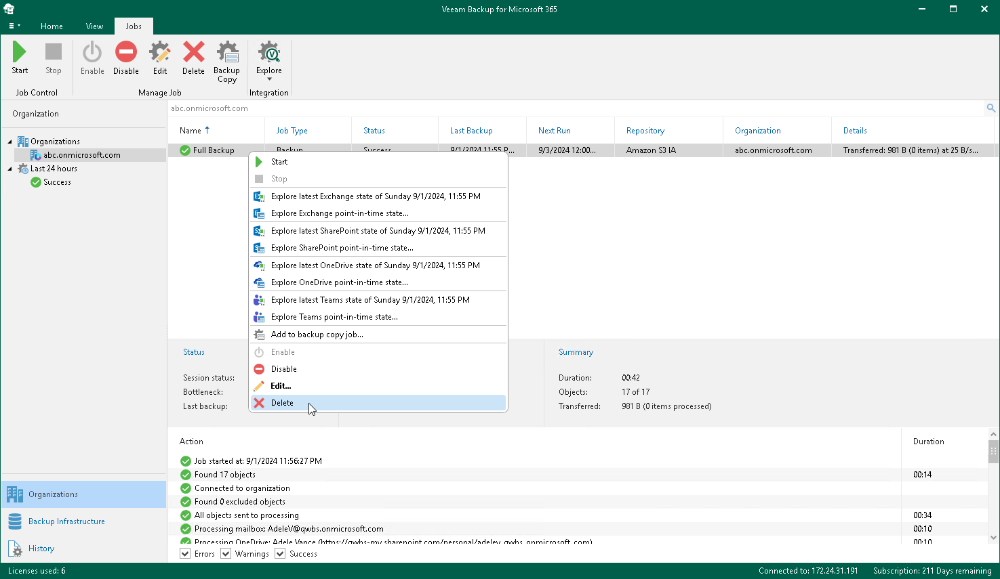

In this article

You can remove a backup job from the Veeam Backup for Microsoft 365 configuration.

|  |
| --- |
| Note |
| When you remove a backup job, consider the following:   * Veeam Backup for Microsoft 365 keeps the backup data in the backup location. * Veeam Backup for Microsoft 365 cannot remove a backup job if a backup copy job is already created for this backup job. You must remove the backup copy job first. For more information, see [Removing Backup Copy Job](removing_backup_copy_job.md). |

To remove a backup job from the Veeam Backup for Microsoft 365 configuration, do the following:

1. Open the Organizations view.
2. In the inventory pane, select an organization.

|  |
| --- |
| Tip |
| You can also select the root Organizations node to see all backup and backup copy jobs that were created for all organizations added to the scope. |

1. In the preview pane, do one of the following:

* Select a backup job and click Delete on the ribbon.

* Right-click a backup job and select Delete.

Page updated 6/16/2025

Page content applies to build 8.3.0.2201
