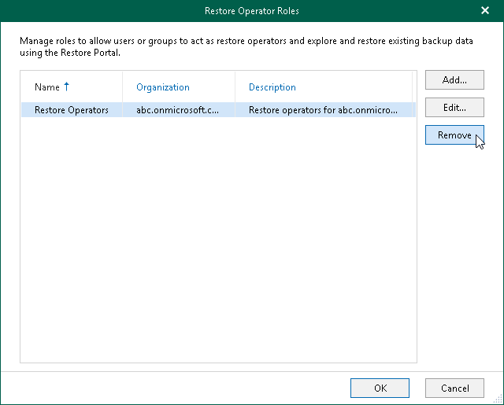

In this article

You can remove a restore operator role from the Veeam Backup for Microsoft 365 configuration if you no longer need it.

To remove a restore operator role, do the following:

1. In the main menu, click Manage Users & Roles > Restore Operator Roles.
2. In the Restore Operator Roles window, select a restore operator role and click Remove.

Page updated 9/2/2024

Page content applies to build 8.3.0.2201
