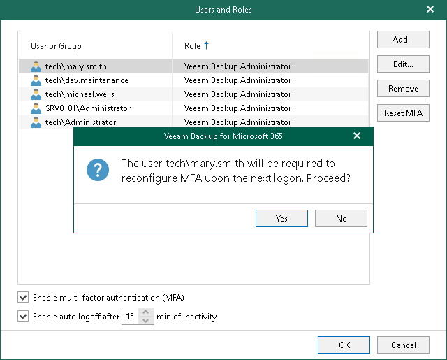

In this article

The Veeam Backup for Microsoft 365 administrator can reset MFA by user request if they have authentication issues, lose or change a mobile device with the mobile authenticator application.

To reset MFA for a specific user, do the following:

1. Log in to the Veeam Backup for Microsoft 365 console using the administrator credentials.
2. In the main menu, click Manage Users & Roles > Users and Roles.
3. In the Users and Roles window, select the user account and click Reset MFA.
4. Confirm the action.

For more information, see [How MFA Works](mfa.md#how_mfa_works).

Page updated 7/18/2024

Page content applies to build 8.3.0.2201
