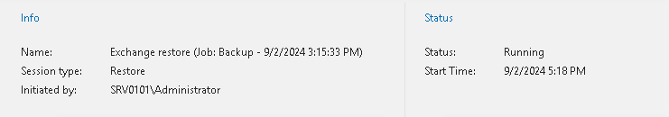

# Viewing Restore Session Metrics

To view a restore session metrics, do the following:

1. Open the History view.
2. In the inventory pane, select the Restore node.
3. In the preview pane, select a restore session.

Metrics of a restore session consist of the following sections:

* The Info section that shows the following fields:

* Name. The name of the restore session.
* Session type. The session type.
* Initiated by. The user name under which the session has been executed or is still in progress.

* The Status section that shows the following fields:

* Status. The status of the session.

Can be Running, Success, Warning, or Error.

* Start Time. The start time of the session.
* End Time. The end time of the session.

