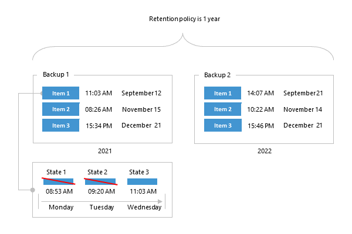
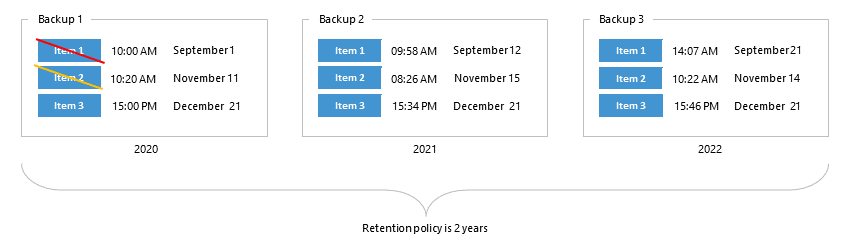
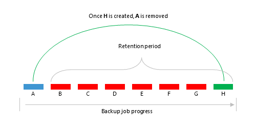
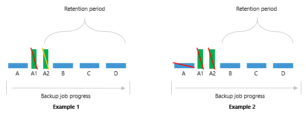
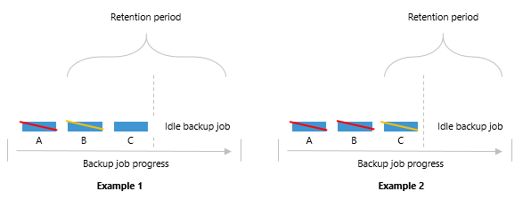

In this article

A retention policy defines how long and under which retention type your backup data should be stored in a backup repository.

Veeam Backup for Microsoft 365 provides the following types of retention:

* [Snapshot-Based Retention](#bc)

Select this type if you want to keep an item state until the restore point of an item state is within the retention coverage.

* [Item-Level Retention](#ar)

Select this type if you want to keep an item until its creation time or last modification time is within the retention coverage.

|  |
| --- |
| Note |
| Both types of retention are supported for either JET-based backup repositories or object storage repositories. Keeps in mind that the retention type cannot be changed once set. For more information, see [Adding JET-Based Backup Repositories](vbo_adding_repository.md) and [Adding Object Storage Repositories](adding_object_storage.md). |

Snapshot-Based Retention

In Microsoft 365, any modification of an item in the production environment leads to the creation of a new item version. A modification means that the user has changed any attribute of an item in the production environment. For example, a new category has been assigned to an email in the mailbox or a document has been renamed in a SharePoint site.

In Veeam Backup for Microsoft 365, each item in a backup repository has its own item state. The item state comprises a cumulative set of item versions created for an item in Microsoft 365. The item state belongs to a specific restore point.

During the initial backup of an item, Veeam Backup for Microsoft 365 creates its initial item state in the first restore point. This item state contains all versions of this item that exist in Microsoft 365 at the moment. After a user has modified the item again, Microsoft 365 creates its new version. During the subsequent incremental backup, Veeam Backup for Microsoft 365 creates a new restore point with a new item state. This new item state cumulatively includes all versions of an item created by Microsoft 365.

When a retention policy is applied to a backup repository with the snapshot-based retention type, Veeam Backup for Microsoft 365 removes the item states. Data removal from a backup repository occurs every time the restore point goes beyond the retention coverage. The items that were never changed stay in a backup repository with the snapshot-based retention type until their restore point is within the retention coverage.

The following example represents two backup files consisting of three items each, where each item has its own backup date. Consider the Item 1 of the Backup 1 storage to be an email message, the attributes of which have been modified three times in the production environment; each modification was made on different days (Monday, Tuesday, and Wednesday) and each modification was successfully backed up.

There are the following states of the Item 1 in the backup repository:

* State 1 includes the initial version of the Item 1 and the modification made on Monday.
* State 2 includes the initial version of the Item 1 and modifications made on Monday and Tuesday.
* State 3 includes the initial version of the Item 1 and modifications made on Monday, Tuesday and Wednesday.

If the retention policy is 1 year and will be applied at 10:00 AM on September 12, 2022, then all states of the Item 1 that exceed the specified retention threshold will be removed from the backup repository. These item states are the State 1 and State 2.

The State 3 is the latest and if no more states will be created for the Item 1, it will be kept in the Backup 1 storage along with the initial states of Item 2 and Item 3.

|  |
| --- |
| Note |
| Backup jobs process all available items regardless of their creation time or last modification time. |

Item-Level Retention

Data removal from backup repositories with the item-level retention type occurs every time the creation time or last modification time of an item in a backup file goes beyond the retention coverage.

The following example represents three backup files; each file contains Microsoft 365 items per year where each item has its own last modification time.

For example, your retention policy is said to be applied at 10:20 AM on September 1, 2022. In such a scenario, Veeam Backup for Microsoft 365 will remove the Item 1 from the Backup 1 repository because the Item 1 exceeds the retention period (2 years in our example) by 20 minutes.

The next item to be removed is the Item 2 because its last modifications were made at 10:20 AM on November 11, 2020. When a retention policy is being applied, for example, at 10:30 AM on November 11, 2022, Veeam Backup for Microsoft 365 removes the Item 2 because its age equals 2 years and 10 minutes which exceeds the specified threshold.

The same is repeated until no items left in a repository. After that, Veeam Backup for Microsoft 365 completely removes such a repository from the hard drive.

|  |
| --- |
| Note |
| Backup jobs do not process items the last modification time of which exceeds the specified retention period. |

Removing Items After Unsuccessful Backup Attempts

If during the subsequent backup job sessions Veeam Backup for Microsoft 365 fails to back up organization mailboxes, Microsoft SharePoint items, Microsoft OneDrive for Business items, or Microsoft Teams items, the product preserves the latest backup state of such items until the next successful backup is created.

The following example represents a backup of the mailbox A which is followed by 6 consecutive unsuccessful attempts (B through G) of backing up that same mailbox during the subsequent backup job sessions. The mailbox A will not be removed until this mailbox is successfully backed up during the attempt H.

Removing Restore Points

The restore points of items are removed as soon as they are out of the retention coverage. Once the latest available restore point is removed, the parent item of such a restore point will be removed as well.

The following example represents four items (A through D) and two restore points (A1 and A2) both of which belong to the item A. The A1 restore point has already been removed since it was out of the retention coverage, whereas the A2 restore point will only be removed after it goes out of the retention coverage (Example 1).

Once the latest restore point is out of the retention coverage and, therefore, can safely be removed, the item A — the parent item of the latest restore point A2 — will be removed as well (Example 2).

Backup Job Idleness

If a backup job has created a successful backup and then went idle for an indefinite period of time (for example, it become disabled), then all the data created by such a job will be removed once it is out of the retention coverage.

The following example represents the mailbox A that has been removed because it was already out of the retention coverage (Example 1). The next mailbox that will be removed is the mailbox B, the removal of which will happen once it goes beyond the retention coverage (Example 2).

The same is applicable to Microsoft SharePoint, Microsoft OneDrive for Business and Microsoft Teams.

Object Storage Retention for Backup Copies

Consider the following:

* The retention type of the object storage repository selected as a target for a backup copy job must match that of the object storage repository where you store your backups. The retention period can be different.
* If you increase the retention period for the object storage repository selected as a target for a backup copy job that has the item-level retention type and start a backup copy job without source backup job started prior to that, Veeam Backup for Microsoft 365 will not copy backed-up data of items whose last modification time fits the updated retention coverage of backup copy.

Related Topics

* [Creating Backup Copy Job](vbo_new_copy_job.md)
* [Editing Backup Repository Settings](vbo_editing_repository.md)
* [Immutability](immutability.md)

Page updated 9/30/2024

Page content applies to build 8.3.0.2201
