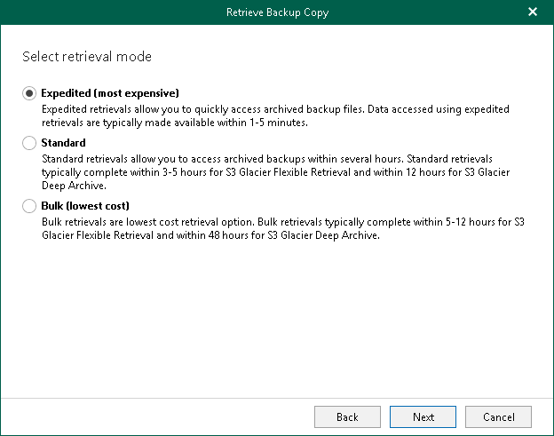
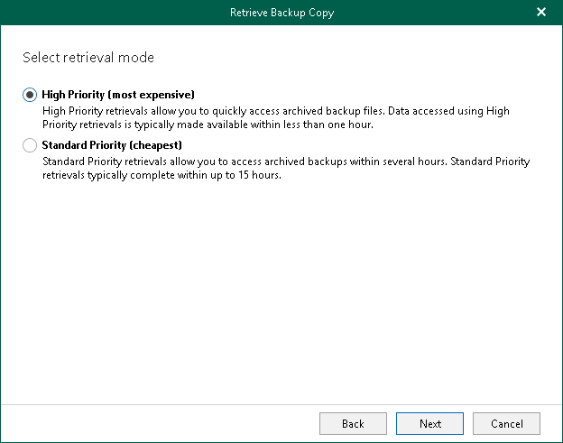

In this article

At this step of the wizard, select a retrieval mode that you want to use. Data retrieval cost varies depending on the desired speed of the process. Options differ for Azure Blob Storage Archive, Amazon S3 Glacier Flexible Retrieval and Amazon S3 Glacier Deep Archive.

Amazon S3 Glacier Flexible Retrieval / Amazon S3 Glacier Deep Archive

Select one of the following options:

* Expedited

Use this option to access your backed-up data within several minutes.

* Standard

Use this option to access your backed-up data within several hours.

* Bulk

Use this option to access your backed-up data within the longer time period.

Azure Blob Storage Archive

Select one of the following options:

* High Priority

Use this option to access your backed-up data within 1 hour.

* Standard Priority

Use this option to access your backed-up data within several hours.

Page updated 9/2/2024

Page content applies to build 8.3.0.2201
