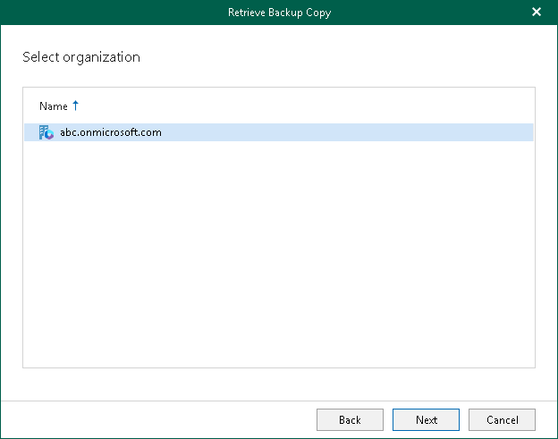

In this article

At this step of the wizard, select an organization. Veeam Backup for Microsoft 365 will retrieve from the backed-up data of objects that are belong to the selected organization.

Page updated 9/2/2024

Page content applies to build 8.3.0.2201
