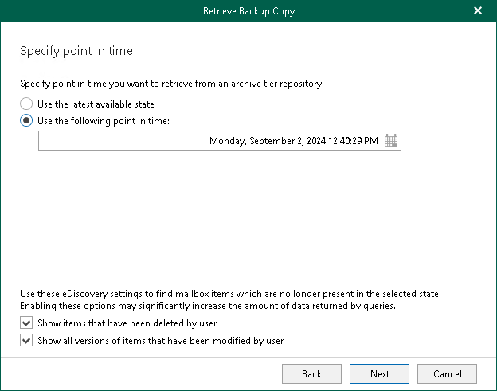

In this article

At this step of the wizard, select a backup state of the backed-up data that you want to retrieve from the object storage repository:

1. Select one of the following options:

* Use the latest available state. Select this option to retrieve the latest state of the backed-up data.
* Use the following point in time. Select this option to retrieve the backed-up data of the selected date.

1. If you want to view historic data, select the following check boxes:

* Show items that have been deleted by user. Select this option to show items that have been removed by the user before the specified date.
* Show all versions of items that have been modified by user. Select this option to show all versions of items that have been modified by the user before the specified date.

Page updated 9/2/2024

Page content applies to build 8.3.0.2201
