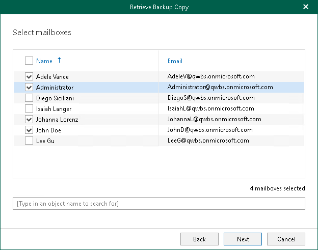
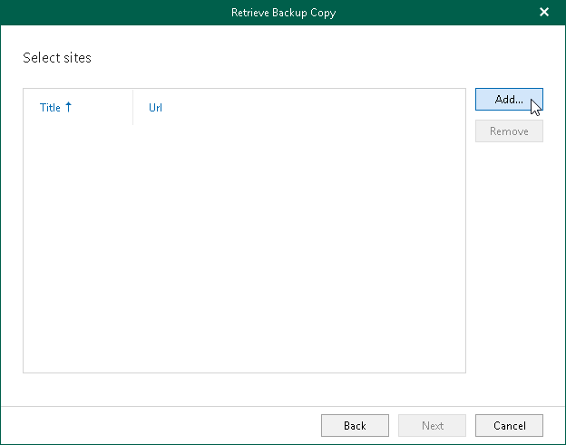
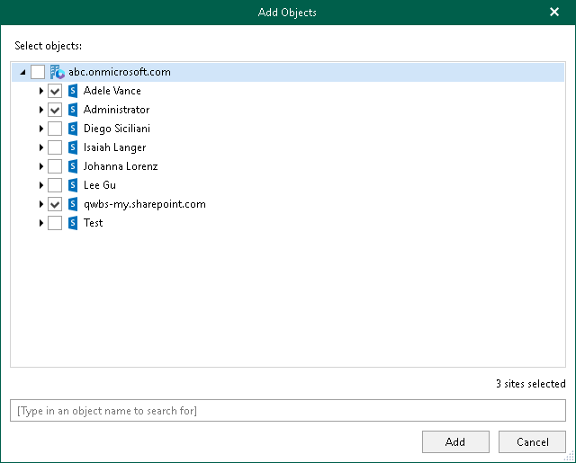

In this article

At this step of the wizard, select check boxes next to the objects (mailboxes, OneDrives, teams) whose backed-up data you want to retrieve from the object storage repository.

Selecting SharePoint Sites

If you want to retrieve backed-up data of the SharePoint sites, do the following:

1. Click Add.

1. In the Add Objects window, select check boxes next to the sites or subsites whose backed-up data you want to retrieve.

|  |
| --- |
| Tip |
| To quickly find necessary sites or subsites, you can use the search field at the bottom. |

1. Click Add.

The selected objects appear in the list of SharePoint sites whose backed-up data you want to retrieve.

Page updated 9/2/2024

Page content applies to build 8.3.0.2201
