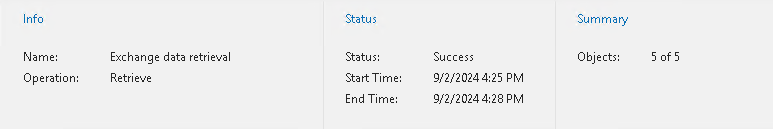

In this article

You can view a retrieve session metrics in one of the following ways:

* Open the Organizations view and in the inventory pane, select the Data retrieval node and then select a retrieval job in the preview pane.
* Open the History view and in the inventory pane, select the Retrieve node and then select a retrieve session in the preview pane.

Metrics of a retrieve session consist of the following sections:

* The Info section that shows the following fields:

* Name. The name of the retrieve session.
* Operation. The name of the operation.

Can be Retrieve or Remove.

* The Status section that shows the following fields:

* Status. The status of the session.

Can be Running, Success, Warning, or Error.

* Start Time. The start time of the session.
* End Time. The end time of the session.

* The Summary section that shows the following fields:

* Objects. Shows how many objects have been selected for retrieval of their backed-up data.

An object is an OneDrive account, SharePoint site, Microsoft Teams team, mailbox and archive mailbox, including group mailboxes, public folders and discovery search mailboxes.

* Processed. Shows how many blob files have been downloaded.

Page updated 10/13/2025

Page content applies to build 8.3.0.2201
