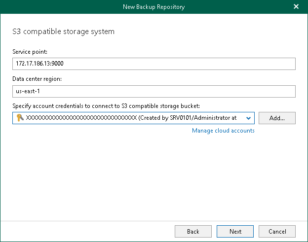

In this article

At this step of the wizard, specify a service point of your S3 Compatible device, select a datacenter region and specify account credentials.

1. In the Service point field, specify an endpoint address of your S3 Compatible device.
2. In the Data center region field, specify a region.
3. From the Specify account credentials to connect to S3 compatible storage bucket drop-down list, select user credentials to access your S3 Compatible object storage.

If you already have a credentials record that was configured beforehand, select such a record from the drop-down list. Otherwise, click Add and provide your access and secret keys. For more information, see [Adding S3 Compatible, IBM Cloud and Wasabi Cloud Storage Access Key](s3_compatible_access_key.md). You can also click Manage cloud accounts to [manage existing credentials records](edit_remove_cloud_creds.md).

Page updated 7/17/2024

Page content applies to build 8.3.0.2201
