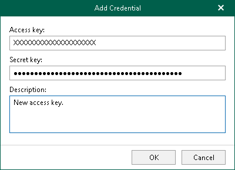

In this article

You can add new credentials for [S3 Compatible](adding_s3compatible.md) object storage, [IBM Cloud Object Storage](adding_ibm_object_storage.md) and [Wasabi Cloud Object Storage](adding_wasabi_object_storage.md).

To add credentials, do the following:

1. In the main menu, click Credentials & Passwords > Manage Cloud Credentials.
2. In the Cloud Credential Manager window, click Add > S3 Compatible access key.
3. In the Access key field, enter your access key.
4. In the Secret key field, enter your secret key.
5. In the Description field, enter optional description.
6. Click OK.

Related Topics

* [Adding S3 Compatible Object Storage Repositories](adding_s3compatible.md)
* [Adding IBM Cloud Object Storage Repositories](adding_ibm_object_storage.md)
* [Adding Wasabi Cloud Object Storage Repositories](adding_wasabi_object_storage.md)
* [Editing and Removing Cloud Credentials](edit_remove_cloud_creds.md)

Page updated 10/13/2025

Page content applies to build 8.3.0.2201
