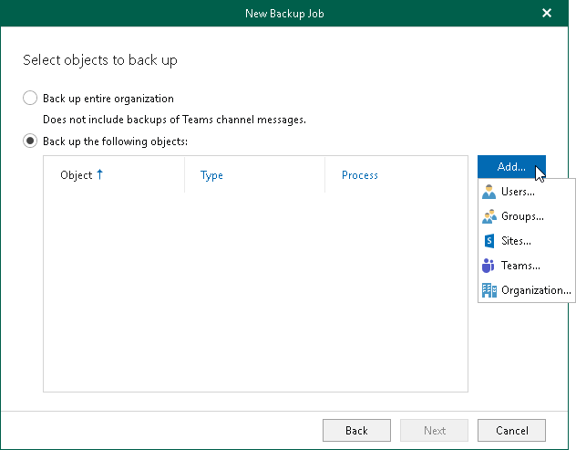

In this article

At this step of the wizard, select objects that you want to back up.

In Veeam Backup for Microsoft 365, you can select to back up the entire organization or choose specific users, groups, sites, teams, and organizations.

Consider the following:

* You can create only one entire organization backup job per organization.
* Objects that are already added to the scope of any of your backup jobs will be skipped from the entire organization processing list.
* Due to possible access limitations some Site type objects may be unavailable.
* You can add the following objects for [Microsoft 365 organizations](vbo_add_office365_org.md) with modern app-only authentication: Public Folder Mailboxes and Discovery Search Mailboxes. For more information about the Exchange.ManageAsApp permission and the Global Reader role that Microsoft Entra application requires to back up these objects, see [Permissions for Backup](ad_app_permissions_sd.md#Exchange.ManageAsApp) and [Granting Global Reader Role to Microsoft Entra Application](ad_app_permissions_sd.md#app_role).
* When you add an Organization object, [processing options](back_up_organization.md) are applied to all users, groups and sites in the selected organization.

Back Up Entire Organization

To back up all objects within the selected Microsoft organization, select Back up entire organization. Veeam Backup for Microsoft 365 turns off team chats backup to avoid unexpected costs incurred by Microsoft. Processing options for the entire organization cannot be configured.

Back Up Specific Objects

To back up specific users, groups, sites, teams, and organizations, do the following:

1. Select Back up the following objects.
2. Click Add and select one of the following options: [Users](back_up_users.md), [Groups](back_up_groups.md), [Sites](back_up_sites.md), [Teams](back_up_teams.md), or [Organization](back_up_organization.md).

If you have selected the Teams chats check box when you added a Microsoft 365 organization to Veeam Backup for Microsoft 365, you can enable team chats backup in processing options for [Teams](back_up_teams.md#processing_options) and [Organization](back_up_organization.md#processing_options).

|  |
| --- |
| Note |
| If you select a group, site or team as an individual object for backup (and not as a part of a user account, group or organization), this object does not consume a unit from the Veeam license. |

Page updated 10/7/2025

Page content applies to build 8.3.0.2201
