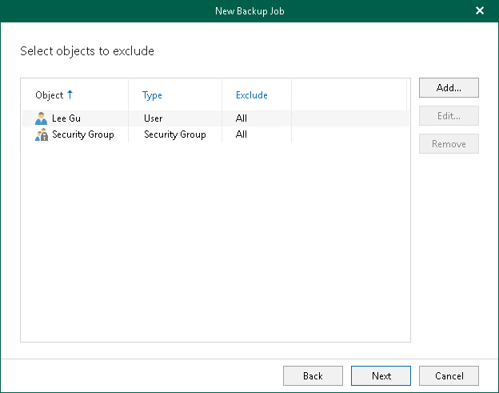
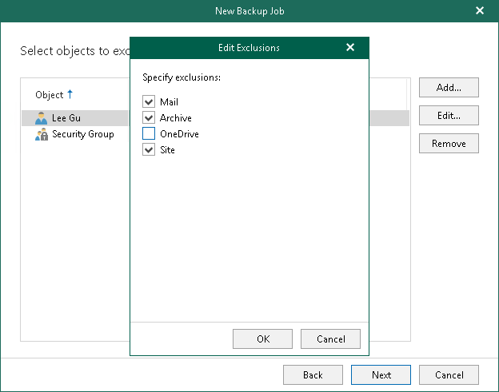
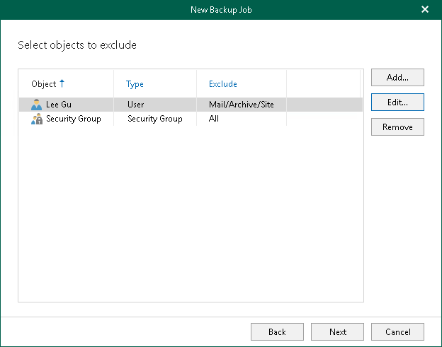

In this article

At this step of the wizard, select objects that you do not want to back up.

To exclude an object, click Add and select users, groups, sites, and teams that you do not want to back up.

|  |
| --- |
| Note |
| You can add the following objects for [Microsoft 365 organizations](vbo_add_office365_org.md) with modern app-only authentication: Public Folder Mailboxes and Discovery Search Mailboxes. For more information about the Exchange.ManageAsApp permission and the Global Reader role that Microsoft Entra application requires to back up these objects, see [Permissions for Backup](ad_app_permissions_sd.md#Exchange.ManageAsApp) and [Granting Global Reader Role to Microsoft Entra Application](ad_app_permissions_sd.md#app_role). |

If you want to specify exclusion options, select an object in the list, click Edit and in the Edit Exclusions window, select exclusion options that you want to apply.

For more information about available object types and their exclusion options, see [Organization Object Types](vbo_object_types.md).

|  |
| --- |
| Note |
| You cannot edit exclusion options for the Sites, Teams and Public Mailbox objects. |

The following is an example where the Mail, Archive and Site are excluded from the backup for the selected user. Veeam Backup for Microsoft 365 will only back up OneDrive data for this user.

To see what Veeam Backup for Microsoft 365 will exclude for the selected object to exclude, refer to the Exclude column. In this example, Veeam Backup for Microsoft 365 will exclude Mail, Archive and Site.

Page updated 8/23/2024

Page content applies to build 8.3.0.2201
