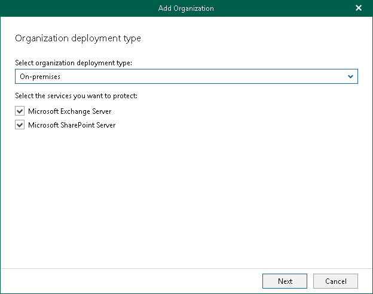

# Step 2. Select Organization Deployment Type

At this step of the wizard, select a deployment type and on-premises services that you want to protect.

To select a deployment type and services, do the following:

1. From the Select organization deployment type drop-down list, select On-premises.
2. Select services that you want to protect:

* Microsoft Exchange Server

Select this check box if you want to back up Microsoft Exchange data.

* Microsoft SharePoint Server

Select this check box if you want to back up Microsoft SharePoint data.

