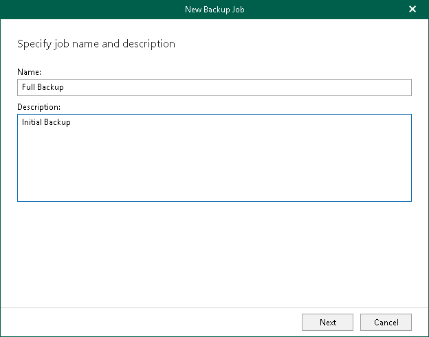

In this article

At this step of the wizard, enter a name for the backup job and provide optional description:

1. In the Name field, enter a name for the backup job.
2. In the Description field, enter optional description.

Page updated 7/19/2024

Page content applies to build 8.3.0.2201
