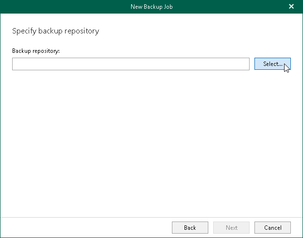
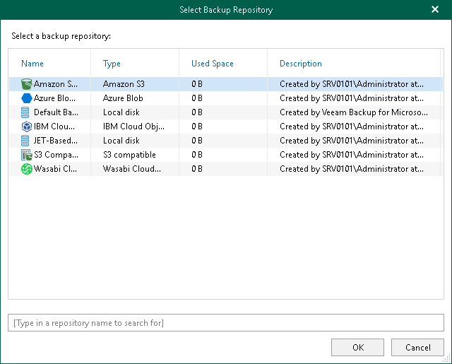

In this article

At this step of the wizard, specify an object storage repository or a JET-based backup repository where you want to store your backups.

|  |
| --- |
| Note |
| Consider the following:   * If you you want to store your backups in an object storage repository, all data will be compressed and backed up directly to object storage. To save cache with backup metadata, Veeam Backup for Microsoft 365 uses the PersistentCache database created by Veeam Backup for Microsoft 365 on the PostgreSQL instance. For more information, see [Cache](understanding_cache.md). * If you want to create backup copies, you must specify an object storage repository to store your backups. * Azure Blob Storage Archive access tier and all Amazon S3 Glacier storage classes are not listed because Veeam Backup for Microsoft 365 uses them only as a target for backup copy jobs. * If you back up data of on-premises Microsoft organizations, you cannot specify an object storage repository associated with a Linux-based backup proxy server or a backup proxy pool that includes a Linux-based backup proxy server. |

To specify an object storage repository or a JET-based backup repository, do the following:

1. Click Select.

1. In the Select Backup Repository window, select an object storage repository or a JET-based backup repository that you want to use.

|  |
| --- |
| Tip |
| To quickly find necessary backup repositories, you can use the search field at the bottom. |

1. Click OK.

Page updated 8/30/2024

Page content applies to build 8.3.0.2201
