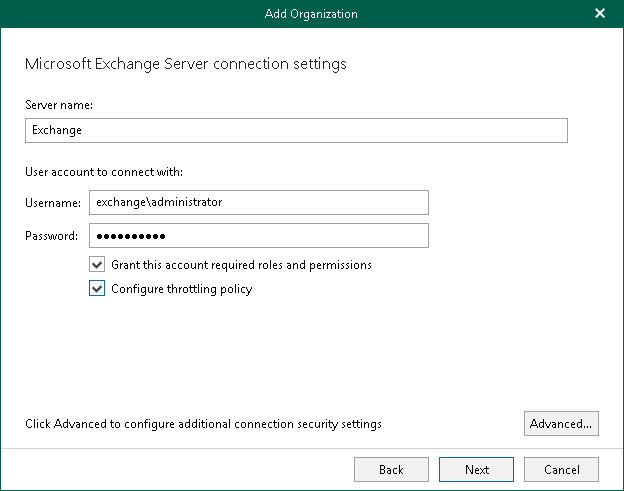
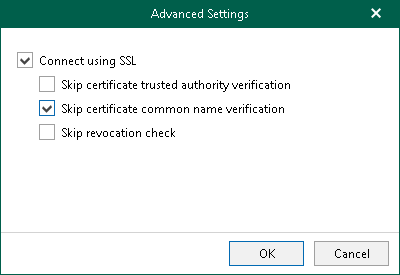

# Step 3. Specify Microsoft Exchange Connection Settings

At this step of the wizard, specify a Microsoft Exchange server to which you want to connect, provide authentication credentials, assign permissions and configure advanced settings.

To specify connection settings to the on-premises Microsoft Exchange server, do the following:

1. In the Server name field, specify a Microsoft Exchange server to which you want to connect.

You can use a DNS name of a server, NetBIOS name or its IP address. Make sure that the server has the Mailbox Server role.

1. In the Username and Password fields, specify authentication credentials to connect to the Microsoft Exchange server.

You must provide a user account in one of the following formats: domain\account or account@domain. Consider that using ADFS accounts to add on-premises Microsoft organizations is not possible. Only Microsoft 365 organizations can be added with non-MFA enabled ADFS accounts.

1. Select the Grant this account required roles and permissions check box to automatically assign the ApplicationImpersonation role.

Make sure the account that you use is a member of the Organization Management group and has been granted the Role Management role in advance. Otherwise, the automatic assignment of the ApplicationImpersonation role will fail; an organization will not be added.

For more information about the required roles and permissions, see [Veeam Backup Account Permissions](permissions_veeam_backup_account.md).

1. Select the Configure throttling policy check box to set the throttling policy for the account being used to Unlimited.

1. Click Advanced if you want to configure whether to connect to the Microsoft Exchange server using SSL and to skip one or more SSL verifications. To do this, select or clear any of the following check boxes:

* Connect using SSL

* Skip certificate trusted authority verification
* Skip certificate common name verification
* Skip revocation check

