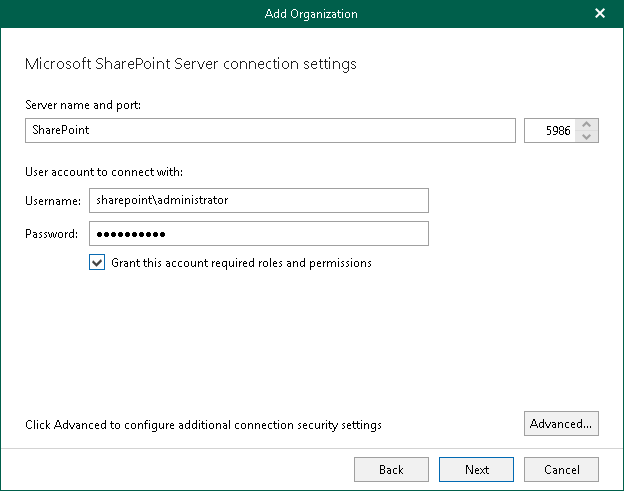

# Step 4. Specify Microsoft SharePoint Connection Settings

At this step of the wizard, specify a Microsoft SharePoint server to which you want to connect, provide authentication credentials, assign permissions and configure advanced settings.

To specify connection settings to the on-premises Microsoft SharePoint server, do the following:

1. In the Server name and port field, specify a Microsoft SharePoint server name and the WinRM port number.

You can use a DNS name of a server, NetBIOS name or its IP address.

1. In the Username and Password fields, specify authentication credentials to connect to the Microsoft SharePoint server.

You must provide a user account in one of the following formats: domain\account or account@domain. Consider that using ADFS accounts to add on-premises Microsoft organizations is not possible. Only Microsoft 365 organizations can be added with non-MFA enabled ADFS accounts.

1. Select the Grant this account required roles and permissions check box to automatically add a user account to the SharePoint Site Collection Administrators group and grant this user administrative privileges to access Microsoft SharePoint sites. This option also grants access to the User Profile service to work with OneDrive data.

For more information about the required roles and permissions, see [Veeam Backup Account Permissions](permissions_veeam_backup_account.md).

1. Click Advanced if you want to configure whether to connect to the Microsoft SharePoint server using SSL and to skip one or more SSL verifications. To do this, select or clear any of the following check boxes:

* Connect using SSL

* Skip certificate trusted authority verification
* Skip certificate common name verification
* Skip revocation check

