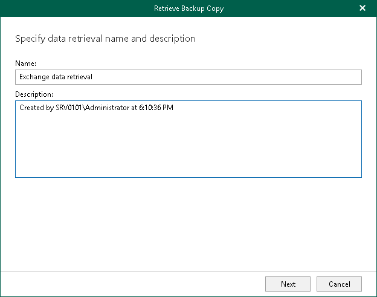

# Step 2. Specify Retrieval Job Name

At this step of the wizard, edit the suggested name for the retrieval job if needed and provide optional description:

1. In the Name field, edit the retrieval job name that Veeam Backup for Microsoft 365 suggests.
2. In the Description field, enter optional description.

