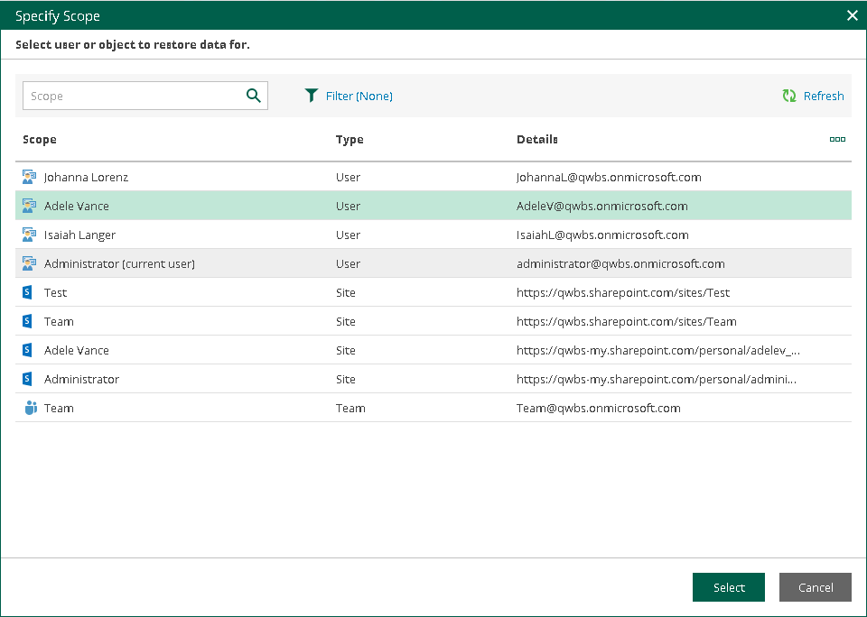

# Changing Restore Operator Scope

After logging in to Restore Portal, restore operators can view the list of objects available to them to manage — that is, to explore and restore data from backups created by Veeam Backup for Microsoft 365 for these objects. For more information on how assign permissions to a restore operator, see [Adding Restore Operator Role](ssp_adding_operator_roles.md).

Restore operators can manage data of organization objects separately. Thus, they must switch between the managed objects: users, groups (group members only), sites, teams or the entire Microsoft 365 organization. In terms of Veeam Backup for Microsoft 365, this operation is called Changing restore operator scope.

|  |
| --- |
| Note |
| If a restore operator is allowed to explore and restore data from backups created by Veeam Backup for Microsoft 365 for all objects within a Microsoft 365 organization, loading of available objects may take a considerable time. To avoid this, the Veeam Backup for Microsoft 365 administrator can edit the restore operator role settings and select not the entire organization, but specific users, groups, sites, or teams as objects to manage. For more information, see [Editing Restore Operator Role Settings](editing_operator_role_settings.md) and [Select Objects to Manage](ssp_role_objects_to_manage.md). |

To select an object whose backed-up data a restore operator will explore and restore, do the following:

1. In the upper-left corner of the Restore Portal window, click You or the name of the object managed last.
2. In the Specify Scope window, select an object that you want to manage. You can search objects and filter them by their organization object type.

|  |
| --- |
| Note |
| You can select only objects that currently exist in Microsoft 365 organization. To explore and restore data from backups created for objects that do not exist in Microsoft 365 organization, use Veeam Explorers. For more information, see [Veeam Explorers User Guide](https://helpcenter.veeam.com/docs/vbo365/explorers/explorers_introduction.html?ver=80). |

1. Click Select.

The name of the selected object will appear in the upper-left corner of the Restore Portal window. The [Explore](ssp_ui.md#explore) tab will be displayed, on which you can browse through the hierarchy of folders with backed-up data of the selected object and [select a restore point](ssp_selecting_restore_point.md).

