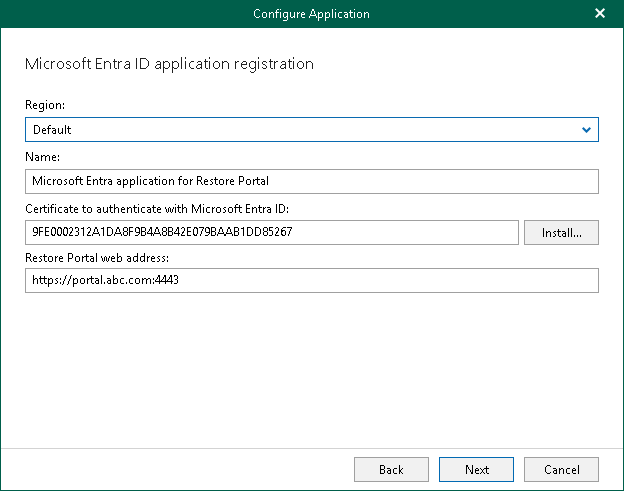
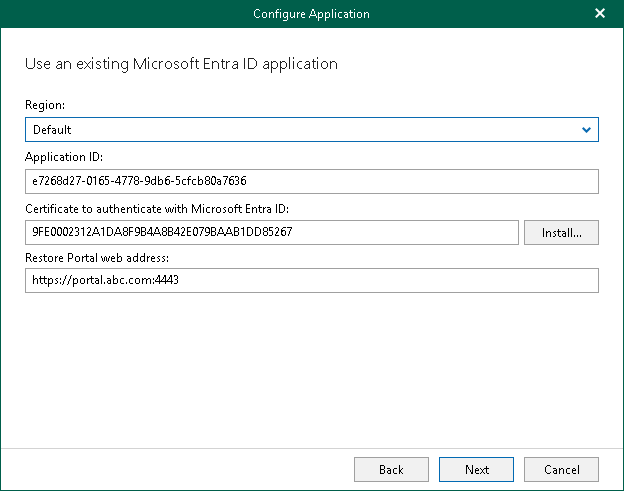

# Step 3. Register or Configure Microsoft Entra Application

At this step of the wizard, you can create a new application in Microsoft Entra ID or configure an existing one.

* [Registering a new application](#cna)

Use this method if you have selected the Register a new Microsoft Entra ID application automatically option at the previous step of the wizard.

* [Configure an existing application](#conf_ea)

Use this method if you have selected the Use an existing Microsoft Entra ID application option at the previous step of the wizard.

|  |
| --- |
| Note |
| Restore operators and end users will be able to use the only URI that you specify in the Restore Portal web address field. If you want to specify multiple redirect URIs that will be used as the Restore Portal web address or set the application as enterprise to allow multi-tenant access, you must configure these settings manually in your Microsoft Entra ID. |

Registering New Microsoft Entra Application

You can register a new Microsoft Entra application in Microsoft Entra ID. Veeam Backup for Microsoft 365 will use this application to connect to Restore Portal. When registering a new Microsoft Entra application, Veeam Backup for Microsoft 365 automatically grants the [required permissions](ssp_ad_application_permissions.md) to this application.

To register a new Microsoft Entra application, do the following:

1. From the Region drop-down list, select a Microsoft Entra region.
2. In the Name field, enter a name that you want to use to register a new Microsoft Entra application in your Microsoft Entra ID.
3. Click Install to specify an SSL certificate that you want to use for data exchange between Restore Portal and the created Microsoft Entra application.

You can generate a new self-signed certificate or use an existing one. When generating a new self-signed certificate, Veeam Backup for Microsoft 365 will register it in Microsoft Entra ID automatically. Before using an existing certificate, make sure to register this certificate in Microsoft Entra ID. For more information, see [this Microsoft article](https://docs.microsoft.com/en-us/azure/active-directory/develop/howto-create-service-principal-portal#certificates-and-secrets).

1. In the Select Certificate wizard, proceed to any of the following options:

* [Generate a new self-signed certificate](vbo_installing_certificate.md#generate_new)

* [Select certificate from the Certificate Store of this server](vbo_installing_certificate.md#selecting_file)
* [Import certificate from a PFX file](vbo_installing_certificate.md#import)

|  |
| --- |
| Note |
| Veeam Backup for Microsoft 365 uses this SSL certificate only for the Microsoft Entra application that you are registering. To communicate with the Veeam Backup for Microsoft 365 server and perform restore operations, Restore Portal uses the REST API SSL certificate. For more information, see [REST API Settings](vbo_rest_api_settings.md). |

1. In the Restore Portal web address field, specify web address of a machine with the Veeam Backup for Microsoft 365 REST API component installed. Restore operators and end users will use this web address to open Restore Portal in a web browser window.

Consider the following:

* The website is available over HTTPS protocol only.
* By default, port 4443 must be opened on the Veeam Backup for Microsoft 365 server or a machine with the Veeam Backup for Microsoft 365 REST API component installed. For more information, see [Ports](vbo_used_ports.md).
* If you configured a different port in the REST API settings, you must specify the same value for the Restore Portal web address. Otherwise, Restore Portal will be unavailable. For more information, see [REST API Settings](vbo_rest_api_settings.md).
* The web address must be specified in one of the following formats:

* https://<IPv4 address>:<port number>, where <IPv4 address> is a public IPv4 address of a machine with the Veeam Backup for Microsoft 365 REST API component installed. For example, https://135.169.170.192:4443.
* https://<DNS hostname>:<port number>, where <DNS hostname> is DNS host name of a machine with the Veeam Backup for Microsoft 365 REST API component installed. For example, https://portal.abc.com:4443.

Configuring Existing Microsoft Entra Application

You can configure an existing Microsoft Entra application to connect to Restore Portal. Veeam Backup for Microsoft 365 checks the Microsoft Entra application permissions, grants the missing [permissions](ssp_ad_application_permissions.md) if needed and updates an SSL certificate.

To configure an existing application, do the following:

1. From the Region drop-down list, select a Microsoft Entra region.

Keep in mind that if you change your Microsoft Entra region, you must also specify another Microsoft Entra application.

1. In the Application ID field, specify an identification number of Microsoft Entra application that you want to use to connect to Restore Portal.

You can find this number in the application settings of your Microsoft Entra ID. For more information, see [this Microsoft article](https://docs.microsoft.com/en-us/azure/active-directory/develop/howto-create-service-principal-portal).

1. Click Install to specify an SSL certificate that you want to use for data exchange between Restore Portal and the created Microsoft Entra application.

You can generate a new self-signed certificate or use an existing one. When generating a new self-signed certificate, Veeam Backup for Microsoft 365 will register it in Microsoft Entra ID automatically. Before using an existing certificate, make sure to register this certificate in Microsoft Entra ID. For more information, see [this Microsoft article](https://docs.microsoft.com/en-us/azure/active-directory/develop/howto-create-service-principal-portal#certificates-and-secrets).

1. In the Select Certificate wizard, proceed to any of the following options:

* [Generate a new self-signed certificate](vbo_installing_certificate.md#generate_new)

* [Select certificate from the Certificate Store of this server](vbo_installing_certificate.md#selecting_file)
* [Import certificate from a PFX file](vbo_installing_certificate.md#import)

|  |
| --- |
| Note |
| Veeam Backup for Microsoft 365 uses this SSL certificate only for the Microsoft Entra application that you are configuring. To communicate with the Veeam Backup for Microsoft 365 server and perform restore operations, Restore Portal uses the REST API SSL certificate. For more information, see [REST API Settings](vbo_rest_api_settings.md). |

1. In the Restore Portal web address field, specify web address of a machine with the Veeam Backup for Microsoft 365 REST API component installed. Restore operators and end users will use this web address to open Restore Portal in a web browser window.

Consider the following:

* The website is available over HTTPS protocol only.
* By default, port 4443 must be opened on the Veeam Backup for Microsoft 365 server or a machine with the Veeam Backup for Microsoft 365 REST API component installed. For more information, see [Ports](vbo_used_ports.md).
* If you configured a different port in the REST API settings, you must specify the same value for the Restore Portal web address. Otherwise, Restore Portal will be unavailable. For more information, see [REST API Settings](vbo_rest_api_settings.md).
* The web address must be specified in one of the following formats:

* https://<IPv4 address>:<port number>, where <IPv4 address> is a public IPv4 address of a machine with the Veeam Backup for Microsoft 365 REST API component installed. For example, https://135.169.170.192:4443.
* https://<DNS hostname>:<port number>, where <DNS hostname> is DNS host name of a machine with the Veeam Backup for Microsoft 365 REST API component installed. For example, https://portal.abc.com:4443.

