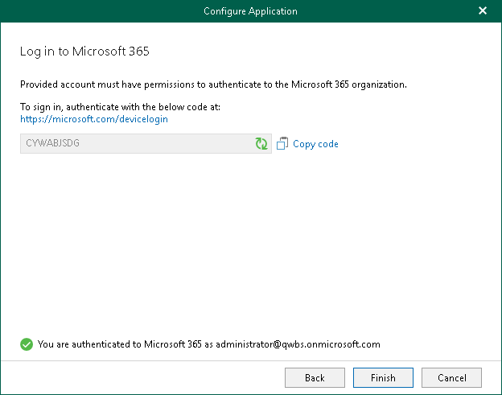

# Step 4. Log In to Microsoft 365

At this step of the wizard, log in to your Microsoft 365 organization.

To log in to the Microsoft 365 organization, do the following:

1. Click Copy code to copy an authentication code.

Keep in mind that a code is valid for 15 minutes. You can click Refresh to request a new code from Microsoft.

1. Click the Microsoft Identity platform authentication server link.

A web browser window opens.

1. On the Sign in to your account webpage, paste the code that you have copied and sign in to Microsoft Identity platform.

Make sure to sign in with the user account that has the Global Administrator role. For more information about this role, see [this Microsoft article](https://docs.microsoft.com/en-us/azure/active-directory/users-groups-roles/directory-assign-admin-roles).

1. Return to the Configure Application wizard and click Finish.

