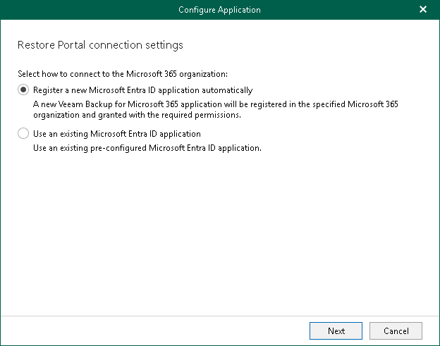

# Step 2. Configure Connection to Restore Portal

At this step of the wizard, choose whether you want to register a new [Microsoft Entra application](https://docs.microsoft.com/en-us/azure/active-directory/manage-apps/what-is-application-management) to connect to Restore Portal or configure an existing Microsoft Entra application.

You can select one of the following options:

* Register a new Microsoft Entra ID application automatically

With this option selected, Veeam Backup for Microsoft 365 requires to provide an application name, a certificate to register a new Microsoft Entra application in Microsoft Entra ID and specify web address of a machine with the Veeam Backup for Microsoft 365 REST API component installed. For more information, see [Registering New Microsoft Entra Application](ssp_create_new_app_2.md#cna).

* Use an existing Microsoft Entra ID application

With this option selected, Veeam Backup for Microsoft 365 requires to modify connection parameters of the existing Microsoft Entra application. For more information, see [Configuring Existing Microsoft Entra Application](ssp_create_new_app_2.md#conf_ea).

