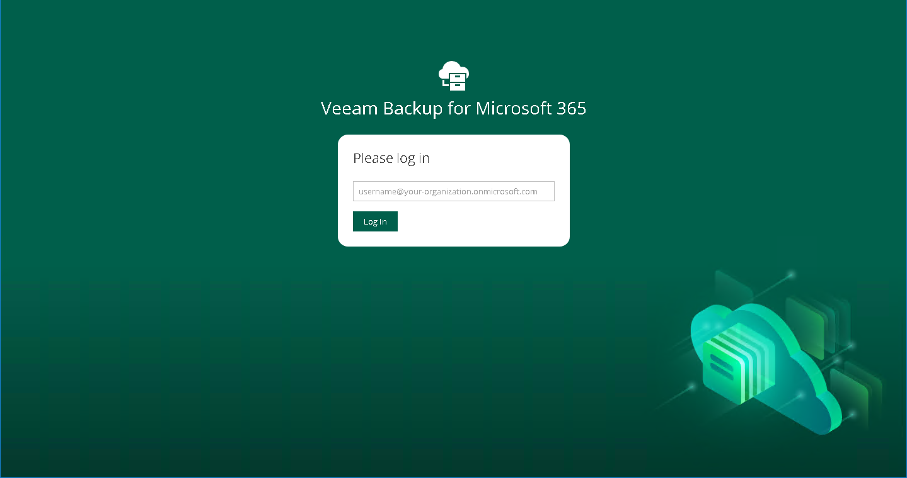

# Launching Restore Portal

To launch Restore Portal, do the following:

1. Open a web browser on any computer and navigate to the Restore Portal web address.

Consider the following:

* The web address must be specified in one of the following formats:

* https://<IPv4 address>:<port number>, where <IPv4 address> is a public IPv4 address of a machine with the Veeam Backup for Microsoft 365 REST API component installed. For example, https://135.169.170.192:4443.
* https://<DNS hostname>:<port number>, where <DNS hostname> is DNS host name of a machine with the Veeam Backup for Microsoft 365 REST API component installed. For example, https://portal.abc.com:4443.

* The Restore Portal web address must be provided by the Veeam Backup for Microsoft 365 administrator.

|  |
| --- |
| Note |
| You can access Restore Portal using the only URI that was specified by the Veeam Backup for Microsoft 365 administrator when registering a new Microsoft Entra application for authentication to Restore Portal. To add another URI or edit the application, the Veeam Backup for Microsoft 365 administrator must configure the application settings in Microsoft Entra ID. For more information on how to configure the Restore Portal web address, see [Creating or Configuring Microsoft Entra Application](ssp_create_new_app_wizard.md). |

* You do not need any Veeam Backup for Microsoft 365 components or Veeam Explorers installed on a computer that you use to access Restore Portal.
* Internet Explorer is not supported. To access Restore Portal, use Microsoft Edge (version 79 or later), Mozilla Firefox (version 21 or later) or Google Chrome (version 24 or later).

1. On the welcome page, enter a user account that you use to connect to the Microsoft 365 organization.

You must provide a user account in one of the following formats: user@domain.com or user@domain.onmicrosoft.com.

1. Click Log In.

Restore Portal will redirect you to the Microsoft Identity platform authentication server where you will be prompted to enter your Microsoft 365 user account password.

|  |
| --- |
| Note |
| If multi-factor authentication (MFA) is enabled in the Microsoft 365 organization, the Microsoft Identity platform authentication server also will prompt the user to verify the user identity using an additional verification method. |

1. If you are a restore operator, select an object that you want to manage. For more information, see [Changing Restore Operator Scope](ssp_changing_scope.md).
2. Select a restore point from which you want to explore and restore data from backups created by Veeam Backup for Microsoft 365. For more information on how to view and select available restore points in Restore Portal, see [Selecting Restore Point](ssp_selecting_restore_point.md).

Logging Out

To log out of Restore Portal, in the upper-right corner of the Restore Portal window, click the user name and click Log Out.

After you log out, all sessions that were opened by Veeam Backup for Microsoft 365 to explore backed-up data are stopped. Restore sessions with restore operations that are running on Restore Portal will continue in the background till data restore completes.

In This Section

* [User Interface](ssp_ui.md)
* [Managing Notifications](ssp_notifications.md)

