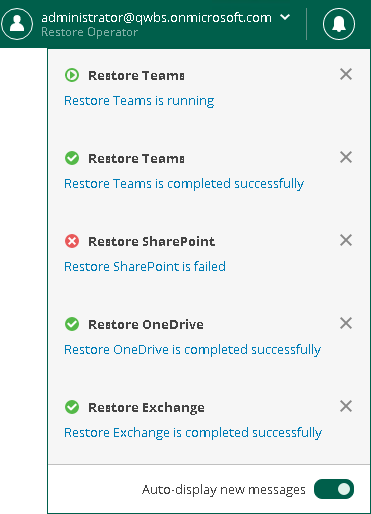

# Managing Notifications

Restore Portal notifies you about restore sessions results. Notifications appear in the [notification pane](ssp_ui.md#notifications).

Each notification includes a restore session name, a status icon, and a status link. If you click the restore session status link, Restore Portal opens the [Restore Sessions](ssp_ui.md#restore_sessions) tab and navigates you directly to the restore session record.

If you want the notification pane to expand automatically when a new notification appears, do the following:

1. Click the notification icon to expand the notification pane.
2. Enable the Auto-display new messages option.

