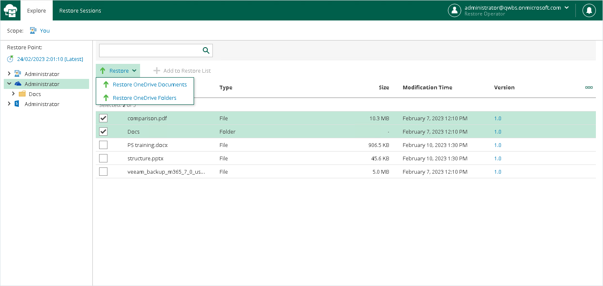
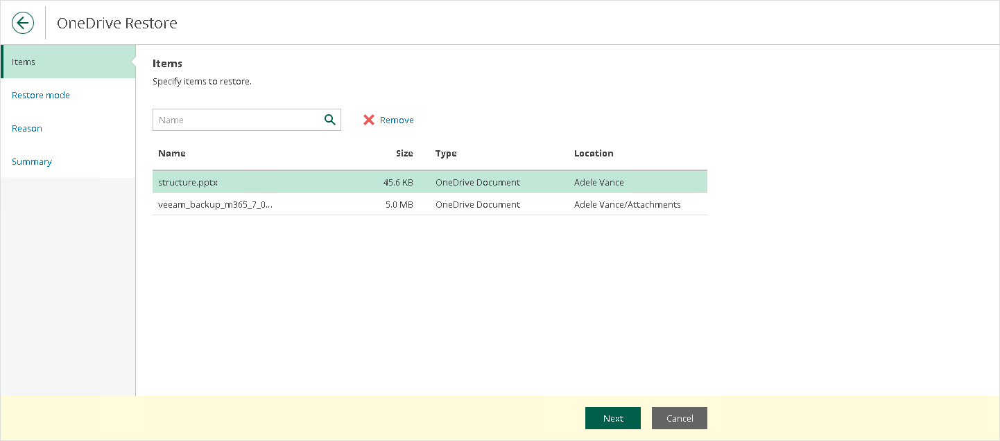
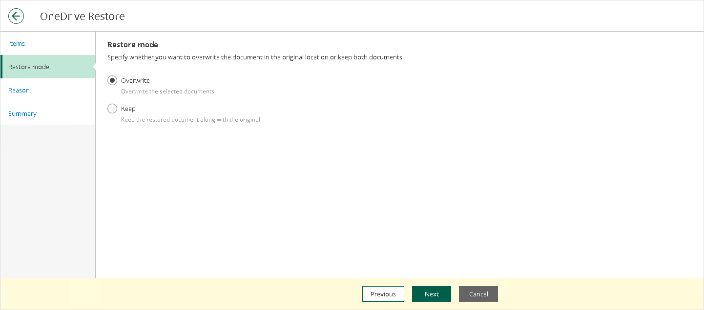
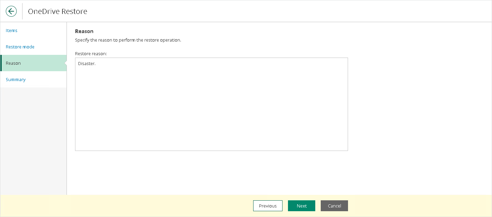

In this article

To restore OneDrive items, do the following:

1. Open the Explore tab.
2. Select a restore point from which you want to explore and restore data. For more information, see [Selecting Restore Point](ssp_selecting_restore_point.md).
3. In the navigation pane, browse through the hierarchy of folders with backed-up data.
4. Select a folder that contains data you want to restore.
5. In the preview pane, select check boxes next to the necessary OneDrive items.

For OneDrive folders and documents, you can select which version of an item you want to restore. To do this, in the Version column, click the most recent version number, and in the displayed window, select the earlier version to restore.

|  |
| --- |
| Note |
| Consider the following:   * Restore Portal displays up to 2000 items, so search for specific items. * You can narrow your search results by specifying various search criteria using the criteria:value format. For more information about search parameters, see [Appendix A. Item Search Parameters](appendix_search.md). * You can also use logical upper-cased operators such as AND, OR and NOT along with wildcard characters such as \* and ?. * To search items by a specific date/time, specify the time in the UTC format. You can hover over the date in the Received column to view the UTC value. |

1. Click Restore and select one of the following options if necessary:

* Restore OneDrive Documents. This option allows you to restore OneDrive documents.
* Restore OneDrive Folders. This option allows you to restore OneDrive folders.

The OneDrive Restore wizard runs to configure the restore operation options.

1. At the Items step, specify items that you want to restore. If you no longer want to restore an item, select it and click Remove.

1. At the Restore mode step, choose whether you want to overwrite the file or document in the original location or keep the restored one along with the original.

1. [Optional] At the Reason step, specify a restore reason. This information will be available in the Reason column on the Restore Sessions tab and you will be able to reference it later.

1. At the Summary step, review details of the restore operation and click Finish.

Restore Portal runs the restore operation immediately and opens the [Restore Sessions](ssp_ui.md#restore_sessions) tab, where you view details about restore session progress and results.

Page updated 3/13/2025

Page content applies to build 8.3.0.2201
