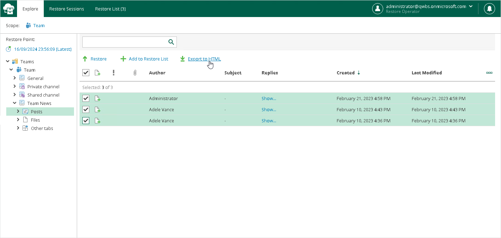

In this article

You can export Microsoft Teams posts to a file in the HTML format.

To export posts to a file in the HTML format, do the following:

1. Open the Explore tab.
2. Select a restore point from which you want to explore data. For more information, see [Selecting Restore Point](ssp_selecting_restore_point.md).
3. In the navigation pane, browse through the hierarchy of folders with backed-up data.
4. Select the Posts folder that contains posts you want to export.
5. In the preview pane, select check boxes next to the necessary Microsoft Teams posts and click Export to HTML.

|  |
| --- |
| Note |
| Consider the following:   * Restore Portal displays up to 2000 items, so search for specific items. * You can narrow your search results by specifying various search criteria using the criteria:value format. For more information about search parameters, see [Appendix A. Item Search Parameters](appendix_search.md). * You can also use logical upper-cased operators such as AND, OR and NOT along with wildcard characters such as \* and ?. * To search items by a specific date/time, specify the time in the UTC format. You can hover over the date in the Received column to view the UTC value. |

Restore Portal creates the export file with a name that includes the channel name and the operation timestamp. You can view this file in a browser window.

Page updated 3/13/2025

Page content applies to build 8.3.0.2201
