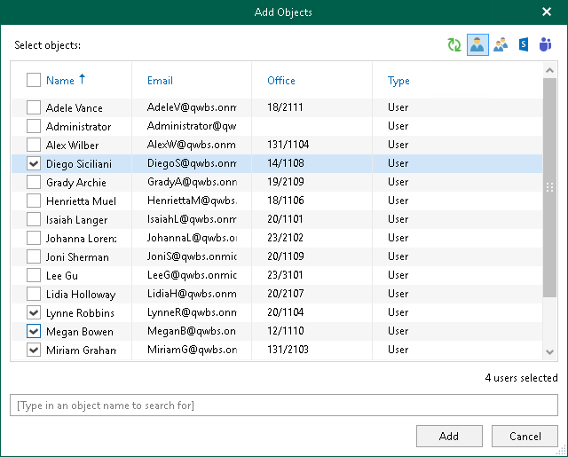
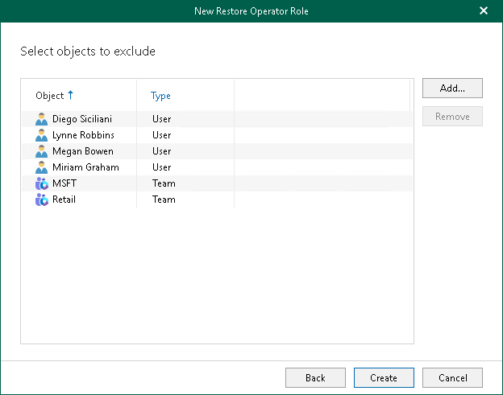

In this article

At this step of the wizard, select objects to exclude. Restore operators will be prohibited to explore and restore backed-up data of these objects using Restore Portal.

To exclude objects, do the following:

1. Click Add and select one of the following options: Users, Groups, Sites, or Teams.
2. In the Add Objects window, select check boxes next to the users, groups, sites, or teams whose backed-up data the restore operators will be prohibited to explore and restore using Restore Portal.

|  |
| --- |
| Tip |
| Consider the following:   * To switch between objects of different types, you can click the buttons in the upper-right corner.  * To refresh the objects list, you can click Refresh.  * To quickly find necessary objects, you can use the search field at the bottom. |

1. Click Add.

The selected objects appear in the list of objects to exclude.

Page updated 9/2/2024

Page content applies to build 8.3.0.2201
