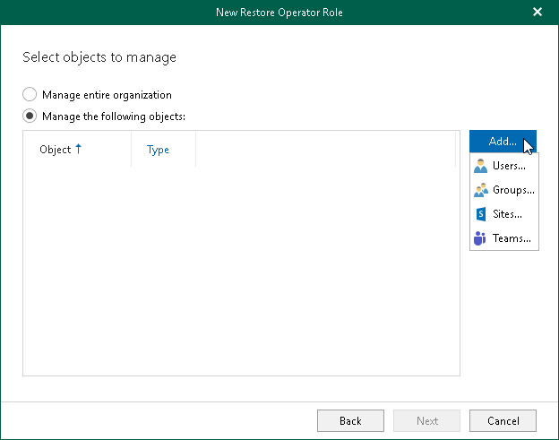
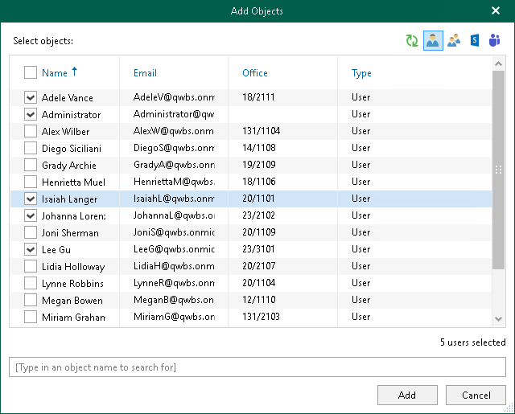
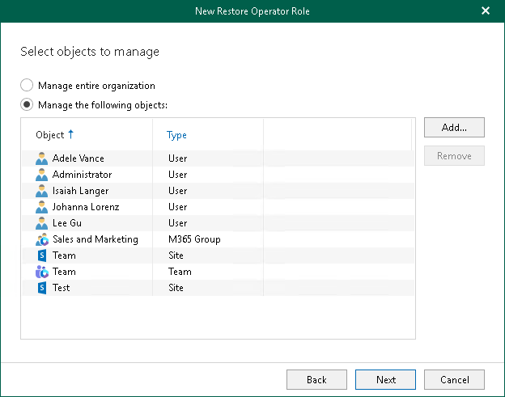

# Step 5. Select Objects to Manage

At this step of the wizard, select objects to manage. Restore operators will be able to explore and restore backed-up data of these objects using Restore Portal.

You can select either the entire organization or specific users, groups, sites, and teams.

To select objects to manage, do the following:

1. Select one of the following options:

* Manage entire organization to allow restore operators to explore and restore data from backups created by Veeam Backup for Microsoft 365 for all objects within the selected Microsoft 365 organization.

Keep in mind that if a restore operator is allowed to explore and restore data from backups created by Veeam Backup for Microsoft 365 for the entire Microsoft 365 organization, changing a restore operator scope may take a considerable time.

* Manage the following objects to allow restore operators to explore and restore data from backups created by Veeam Backup for Microsoft 365 for specific users, groups, sites, or teams.

1. If you selected the Manage the following objects option, click Add and select one of the following options: Users, Groups, Sites, or Teams.

1. In the Add Objects window, select check boxes next to the users, groups, sites, or teams whose backed-up data the restore operators will be able to explore and restore using Restore Portal.

|  |
| --- |
| Tip |
| Consider the following:   * To switch between objects of different types, you can click the buttons in the upper-right corner.  * To refresh the objects list, you can click Refresh.  * To quickly find necessary objects, you can use the search field at the bottom. |

1. Click Add.

The selected objects appear in the list of objects to manage.

