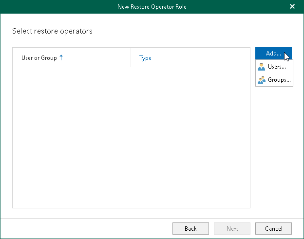
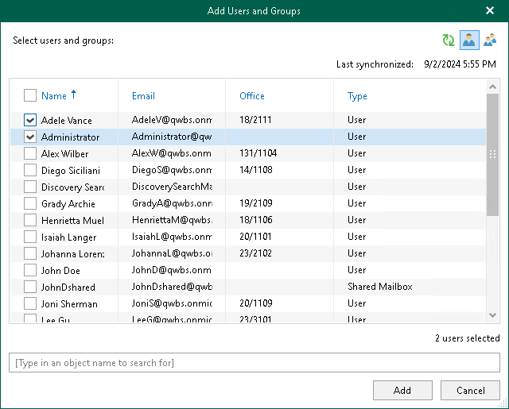
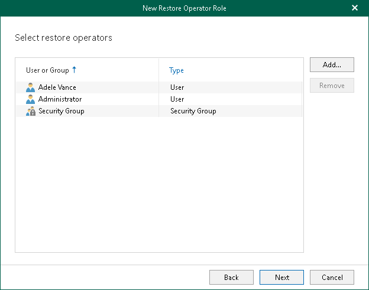

In this article

At this step of the wizard, select users or groups that you want to act as restore operators. Keep in mind that for hybrid organizations, only Microsoft 365 objects can be processed.

To select restore operators, do the following:

1. Click Add and select either Users or Groups.

1. In the Add Objects window, select check boxes next to the users or groups that you want to act as restore operators.

|  |
| --- |
| Tip |
| Consider the following:   * To switch between objects of different types, you can click the buttons in the upper-right corner. * To refresh the objects list, you can click Refresh. * To quickly find necessary objects, you can use the search field at the bottom. |

1. Click Add.

The selected objects appear in the list of restore operators.

Page updated 9/2/2024

Page content applies to build 8.3.0.2201
