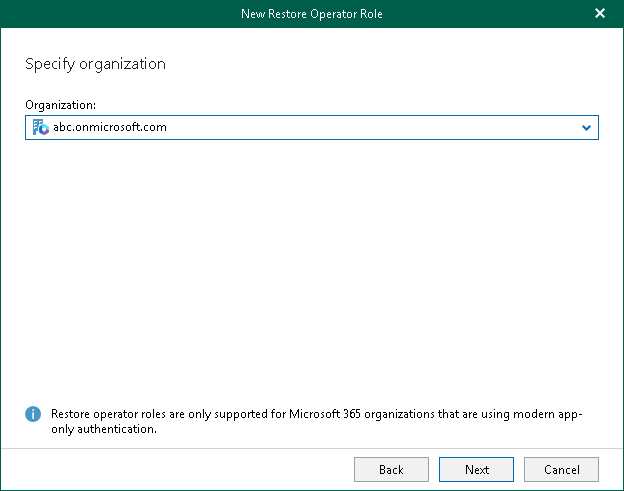

# Step 3. Select Organization

At this step of the wizard, from the Organization drop-down list, select an organization whose users or groups will act as restore operators.

Consider the following:

* You can add restore operator roles only for Microsoft 365 organizations and hybrid organizations.
* The organization for which you want to add a restore operator role must be added to Veeam Backup for Microsoft 365 using the modern app-only authentication method.

