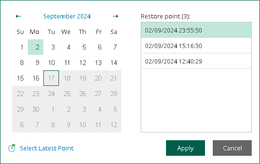

In this article

After you log in to Restore Portal, you must select a restore point from which you want to explore and restore data from backups created by Veeam Backup for Microsoft 365.

|  |
| --- |
| Note |
| If you are a restore operator, you must first select an object that you want to manage and then select a restore point that is available for the selected object in a backup repository. For more information, see [Changing Restore Operator Scope](ssp_changing_scope.md). |

To view available restore points and select a restore point that you want to use, do the following:

1. In the upper-left corner of the Restore Portal window, click Select Restore Point or the restore point timestamp.
2. In the displayed dialog box, do one of the following:

* In the calendar, click the date for which Veeam Backup for Microsoft 365 has available restore points. Such dates are marked in bold. The list of available restore points for the selected date will be displayed on the right.

|  |
| --- |
| Note |
| Consider the following:   * You can select restore points that correspond to backups created by Veeam Backup for Microsoft 365 for an object whose backed-up data you want to explore and restore. * If the latest backups of Exchange, SharePoint and OneDrive data of a user belong to different restore points, Veeam Backup for Microsoft 365 will display the backup data from the selected restore point and from the closest restore points prior to the selected restore point. Keep in mind that this works only if backups reside in the same backup repository. * Only restore points created by Veeam Backup for Microsoft 365 version 6.0 or later will be displayed. * Veeam Backup for Microsoft 365 will not display restore points created by backup copy jobs. |

* Click Select Latest Point to select the latest restore point that is available in a backup repository.

1. Click Apply.

Page updated 8/22/2025

Page content applies to build 8.3.0.2201
